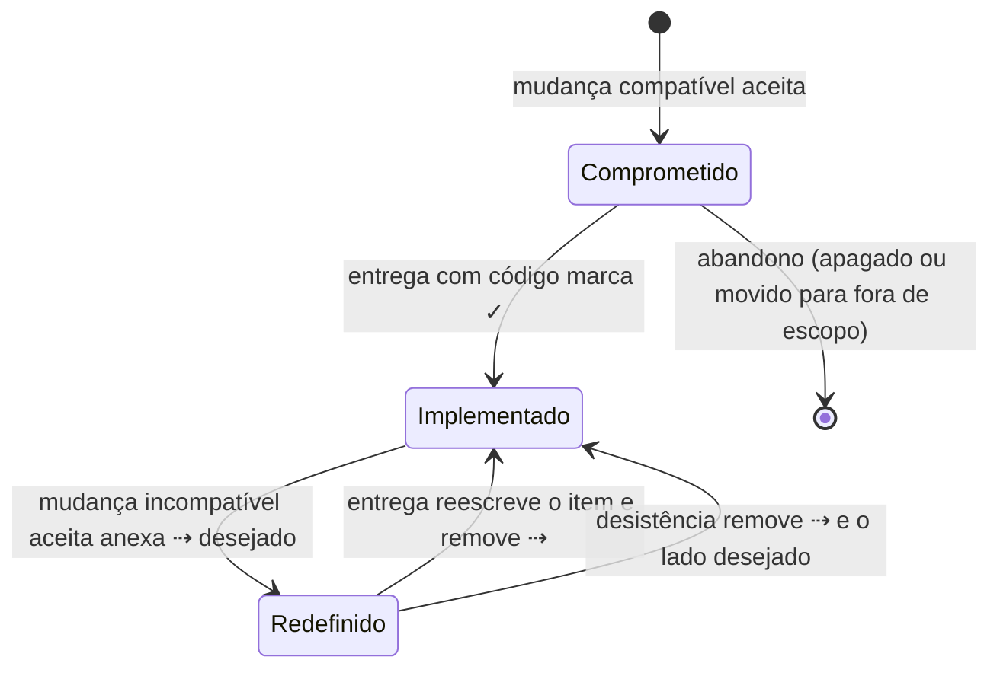
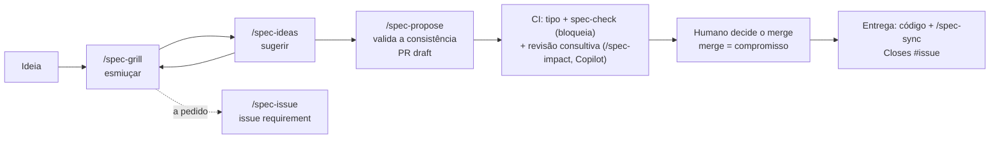

# Fluxo de documentação do produto

> **Documento derivado.** Descreve o fluxo definido em `tabularium-spec/` na versão `8f1d270` da `main`. Não é fonte para agentes: em caso de conflito, vale a spec (`AGENTS.md`, `spec/AGENTS.md` e `tabularium-spec/`). Para atualizá-lo, peça a um agente que o gere de novo a partir da spec.

## O problema e o contexto

**O problema.** Em quase todo projeto, a documentação do produto e o código se separam com o tempo. O documento diz uma coisa e o sistema faz outra. Ninguém sabe o que já foi feito, o que foi só planejado e por que algo foi feito de um jeito e não de outro. Com agentes de IA escrevendo boa parte do código, o problema piora de três formas:
- **O agente precisa da documentação como contexto**, e contexto é caro. Documentos longos, em prosa e espalhados custam leitura e tokens, e o agente acaba lendo pouco ou lendo errado.
- **Documento desatualizado vira instrução errada.** O agente implementa o que o documento diz, mesmo quando isso não vale mais.
- **As decisões se perdem nas conversas.** A razão de uma escolha fica num chat que ninguém relê. A mesma discussão volta meses depois, sem as alternativas já descartadas.

**O que vimos na prática.** Este fluxo nasceu da documentação real de um app, o Iconula, que serve de exemplo em `spec/`. Escrita a partir de planos, ela acumulou quatro tipos de problema:
- **narrativa de mudanças**: "corrige o atual", "removido na migração";
- **detalhes técnicos misturados ao comportamento**: caminhos de banco, tempos de debounce;
- **dezenas de referências** a registros de decisão de cinco tipos diferentes;
- **backlog de ideias futuras**, lido a cada consulta.

Tudo isso num único arquivo, caro de ler e difícil de manter confiável.

**A proposta.** Tratar a descrição do produto como parte do código:
- ela fica no mesmo repositório;
- muda pelos mesmos pull requests;
- é verificada automaticamente;
- é escrita de forma **densa**, para caber inteira no contexto de um agente.

Cada linha diz se é realidade (implementada) ou compromisso (decidido, ainda por fazer). Cada escolha não óbvia tem um registro curto do porquê. E, como a spec cresce por propostas aceitas em momentos diferentes, um processo apoiado por IA confronta cada ideia com a spec vigente, para que ela também não se contradiga. Este é o terceiro desenho dessa ideia; os anteriores não se sustentaram com o uso. As escolhas deste, com as alternativas descartadas, estão em `tabularium-spec/decisions/product/`.

---

## Visão geral

*Para quem conhece o básico de desenvolvimento (Git, pull requests, CI), mas não este fluxo.*

**A ideia central.** A especificação do produto é versionada no próprio repositório, junto com o código, e evolui pelo mesmo mecanismo: pull requests revisados e verificados pelo CI. Ela é escrita de forma compacta, em listas curtas, para que um agente de IA consiga lê-la inteira antes de mexer em qualquer coisa.

**O que fica versionado em `spec/`**
- **Descrição do produto** (`product.md`): glossário, requisitos e regras de negócio, só comportamento observável, sem detalhes de implementação. Cada linha carrega um status:
  - `✓`: implementado;
  - sem marca: aprovado, ainda não implementado;
  - `✓ atual ⇢ desejado`: redefinido; implementado, com mudança aprovada ainda por fazer.
- **Modelo conceitual** (`model.md`): entidades, relações, estados e restrições do domínio. É um modelo de conceitos, não de banco de dados.
- **Documentos técnicos** (`<camada>.md`, opcionais): estado atual de uma camada técnica, como interface ou arquitetura.
- **Registros de decisão** (`decisions/`): um arquivo curto por escolha relevante, com o que foi decidido, o porquê, as alternativas descartadas e um histórico. São parecidos com ADRs, mas só as decisões em vigor ficam na pasta.

**Como uma mudança de requisito acontece**
1. **Discussão**: numa conversa com o agente, a ideia é refinada. O agente faz perguntas, confronta a ideia com o que já está especificado e sugere alternativas e casos de borda. Se for preciso continuar depois, a discussão é guardada numa issue.
2. **Proposta**: com a ideia madura, o agente confere se a spec resultante continua consistente e só então abre um pull request que altera só a spec, já com o texto final. Nada de rascunho de ideias.
3. **Revisão**:
   - o CI deduz o **tipo da mudança** (editorial, neutra, compatível ou incompatível) e aplica a label; quando o diff não mostra se o sentido mudou, a IA julga, e a label aplicada por uma pessoa vence;
   - um check de CI valida as regras da spec para aquele tipo e **bloqueia** o merge se algo estiver errado;
   - um agente de revisão (Copilot ou Claude) comenta possíveis lacunas, sem bloquear;
   - quem decide é uma pessoa, ao fazer o merge.
4. **Aceite**: o merge do PR transforma a proposta em compromisso. Os itens entram na spec sem `✓`, ou com `⇢`.
5. **Entrega**: o código é implementado num PR próprio, e esse mesmo PR marca os itens como `✓`. O check do CI impede marcar algo como implementado num PR sem código.

**Garantias**
- A spec na branch principal reflete o código: o que tem `✓` está implementado.
- Mudança em algo já implementado exige um registro de decisão explicando o porquê.
- Nenhuma proposta é publicada sobre uma spec inconsistente.
- Nenhuma mudança entra sem PR, e a branch principal é protegida.

**E a documentação tradicional?** Visão, casos de uso, diagramas e histórias de usuário não são mantidos à mão, porque duplicariam a spec e ficariam desatualizados. Quando alguém precisa de um deles, pede ao agente que o gere a partir da spec, como foi feito com este arquivo.

---

## Descrição detalhada

### Artefatos

| Artefato | Conteúdo | Regras-chave |
|---|---|---|
| `spec/product.md` | O que é, diferenciais, glossário, requisitos por domínio (requisito → regras), regras transversais, não funcionais, fora de escopo | Autocontido (sem links nem referências), atemporal, só comportamento observável, sem IDs, uma casa por conceito |
| `spec/model.md` | Modelo conceitual, opcional: `## Tipos` e `## Entidades` (atributos, relações com cardinalidade, estados, transições, invariantes) | Sem implementação; tipos de domínio com natureza de lista fechada; todo nome em negrito é termo do glossário ou tipo declarado, verificado pelo CI |
| `spec/<camada>.md` | Documento técnico opcional de uma camada além de `product`, com seções livres | Autocontido, atemporal; mesmos estados e regras de mudança dos itens |
| `spec/decisions/<camada>/*.md` | Uma decisão vigente por arquivo, por camada (`product`, `interface`, `architecture`, `data`, `operations`…): `tema`, `decisao`, `carregar-quando`, depois Decisão, Contexto, Alternativas descartadas, Consequências e Histórico | Só decisões vigentes; decisão que muda leva a escolha antiga para "Alternativas descartadas" |
| `spec/decisions/<camada>/README.md` | Mapa gerado | O agente lê o mapa e abre só as decisões cujo `carregar-quando` corresponde à tarefa |
| `spec/config.json` | Camadas, idioma, caminhos que não são código | Alterado pelo `/spec-init` |
| `AGENTS.md`, `spec/AGENTS.md` | Processo; regras de formato e de mudança (fonte única) | Sem `CLAUDE.md`: a presença dele anula os `AGENTS.md` no Claude Code |
| `REVIEW.md` | Checklist para agentes de revisão (Copilot code review) | Revisão consultiva |

### Estados de um item

### Tipos de mudança

| Tipo | O que faz | Label |
|---|---|---|
| Editorial | muda só o texto da spec, sem mudar sentido; único que altera ou marca `✓` sem código | `spec-editorial` |
| Neutra | não altera o sentido de nenhum requisito: código sem spec, ou entrega de compromisso | `spec-neutral` |
| Compatível | cria requisito, altera item sem `✓` ou cria decisão, sem contradizer nada; pode vir com o código | `spec-compatible` |
| Incompatível | altera o sentido de um item `✓`, contradiz um item existente ou vai contra uma decisão; entra como `⇢` na linha mais baixa afetada e **sempre** cria ou altera uma decisão no mesmo PR | `spec-incompatible` |

PR com vários tipos recebe o maior. O CI deduz o mínimo que o diff prova e aplica a label. Nos casos em que o diff não mostra se o sentido mudou (texto de `✓` ou fora dos itens alterado, compromisso reescrito, decisão existente alterada, `✓` marcado sem código), a IA julga e vale o maior entre o mínimo e o julgado. A label aplicada por uma pessoa vence e nunca é trocada; abaixo do mínimo, é erro. Sem IA (fork ou sem chave), o caso ambíguo exige a label de uma pessoa.

### Ciclo de evolução

1. **Esmiuçar (`/spec-grill`)**: rodadas de perguntas interativas pela árvore de decisões. Lê sempre o `product.md` e o `model.md` inteiros e abre documentos técnicos e decisões à medida que a ideia os alcança. Confronta a ideia com glossário, modelo conceitual, regras transversais, não funcionais, decisões e código, e aponta inconsistências da área tocada. Classifica a mudança pelo tipo e levanta a cascata. Aceita texto, issue ou PR; com PR, aponta a defasagem em relação à `main`. Trabalha só na conversa.
2. **Sugerir (`/spec-ideas`)**: alternativas, cenários de borda, cascata esquecida, riscos e recortes. As sugestões descartadas, com motivo, viram "Alternativas descartadas". Também só na conversa.
3. **Guardar (`/spec-issue`, a pedido)**: publica os resumos numa issue `requirement`, nova ou existente, como memória entre sessões.
4. **Registrar (`/spec-propose`)**: sintetiza o texto final, sem nova entrevista, valida a consistência da spec resultante sobre a `main` atual e só então abre ou atualiza o PR. Qualquer inconsistência, mesmo preexistente, impede a publicação. PR novo nasce em draft; PR existente é rebaseado na `main` com `--force-with-lease`, e a validação confere o reencaixe. Issue e PR se referenciam com `Refs #N`.
5. **Validar**:
   - tipo da mudança deduzido e aplicado pelo CI, com a IA no caso ambíguo;
   - `spec-check` bloqueante;
   - revisão consultiva que nunca bloqueia: Copilot via ruleset e `REVIEW.md`, e/ou Claude via job `spec-review` com `ANTHROPIC_API_KEY`. O conteúdo do PR é tratado como dado, não como instrução.
6. **Aceitar**: qualquer pessoa com permissão de merge, sem aprovação formal obrigatória. O agente só integra a pedido explícito dela. O merge torna o texto compromisso. PR fechado sem merge é recusa.
7. **Entregar**: implementação e `/spec-sync` no mesmo PR:
   - marca `✓` e resolve `⇢`;
   - cita a issue com `Closes #N`;
   - mudança compatível pode vir junto, inclusive com decisão nova;
   - divergência pequena é ajustada como mudança incompatível, com aval de quem integra; divergência grande vira nova proposta.

### Regras verificadas pelo CI (`scripts/spec.mjs check --base`)

Valem para o `product.md`, o `model.md` e os documentos técnicos.

| Situação no PR | Resultado |
|---|---|
| Label de tipo abaixo do mínimo deduzido do diff, ou mais de uma | erro |
| Caso ambíguo sem classificação por IA nem label de uma pessoa | erro |
| Resolver `⇢` sem alterar código | erro, sempre |
| Marcar `✓` ou alterar/remover item `✓` sem código | erro, salvo em PR `spec-editorial` |
| Criar, alterar ou desfazer `⇢`, ou mudança incompatível, sem decisão criada ou alterada | erro |
| Mapa de decisões desatualizado, frontmatter ou seções faltando, link ou referência nos documentos | erro |
| Nome em negrito no `model.md` que não é termo do glossário nem tipo declarado | erro |
| Referência temporal nos documentos, termo de implementação no `model.md`, `CLAUDE.md` presente | aviso |

A `main` é protegida: PR obrigatório, `spec-check` exigido com a branch atualizada, e, se a equipe exigir aprovação, aprovações descartadas a cada commit novo. Isso protege contra propostas concorrentes: uma proposta aceita antes força a outra a ser revalidada.

### Manutenção

- **`/spec-check`**: drift entre a spec e o código, com evidências.
- **`/spec-reconcile`**: verifica a consistência da spec, uma camada por vez: contradição entre itens, entre documentos e com decisões, conceito repetido, termo inconsistente e lacuna de cascata; a camada técnica é confrontada também com o produto. Organiza as decisões (órfãs, lacunas, sobreposição, camada errada) e propõe fundir, dividir, mover ou apagar. Nada muda sem aprovação.
- **`/spec-init`**: estrutura e preferências; pode ser refeito para mudar a configuração.
- **`/spec-extract`**: gera a spec a partir de código existente. `✓` só com evidência no código; o modelo vem do comportamento, nunca do schema.

### Definição do próprio template

A spec do tabularium3 fica em `tabularium-spec/`. Ela e tudo o que o template entrega (instruções, skills, script, workflow e documentação) formam a definição do template, que muda num PR único com a label `tabularium`, sem label de tipo, sem issue e sem entrega separada: todo item fica `✓`. O CI verifica essa spec só na forma; num PR `tabularium`, o exemplo em `spec/` também, o tipo não é classificado e a revisão consultiva não roda. O exemplo Iconula, em `spec/`, serve para experimentar o ciclo de proposta.

### Documentos derivados

A spec não mantém documentos convencionais. Eles são exportados a pedido, ficam fora da spec, declaram que são derivados e de qual versão, e nunca servem de fonte para agentes. Este arquivo é um exemplo disso.
