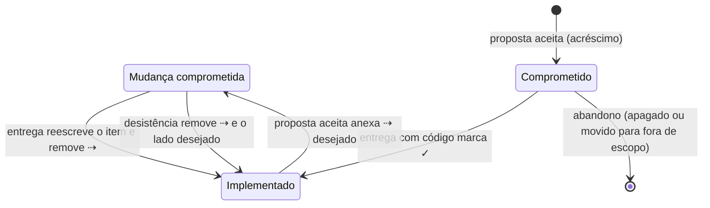
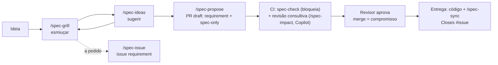

# Fluxo de documentação do produto

> **Documento derivado.** Descreve o fluxo definido em `tabularium-spec/` na versão `e6ae848` da `main`. Não é fonte para agentes: em caso de conflito, vale a spec (`AGENTS.md`, `spec/AGENTS.md` e `tabularium-spec/`). Para atualizá-lo, peça a um agente que o gere de novo a partir da spec.

## O problema e o contexto

**O problema.** Em quase todo projeto, a documentação do produto e o código se separam com o tempo. O documento diz uma coisa e o sistema faz outra. Ninguém sabe o que já foi feito, o que foi só planejado e por que algo foi feito de um jeito e não de outro. Com agentes de IA escrevendo boa parte do código, o problema piora de três formas:
- **O agente precisa da documentação como contexto**, e contexto é caro. Documentos longos, em prosa e espalhados custam leitura e tokens, e o agente acaba lendo pouco ou lendo errado.
- **Documento desatualizado vira instrução errada.** O agente implementa o que o documento diz, mesmo quando isso não vale mais.
- **As decisões se perdem nas conversas.** A razão de uma escolha fica num chat que ninguém relê. A mesma discussão volta meses depois, sem as alternativas já descartadas.

**O que vimos na prática.** Este fluxo nasceu da documentação real de um app, o Iconula, que serve de exemplo em `spec/`. Escrita a partir de planos, ela acumulou quatro tipos de problema:
- **narrativa de mudanças**: "corrige o atual", "removido na migração";
- **detalhes técnicos misturados ao comportamento**: caminhos de banco, tempos de debounce;
- **dezenas de referências** a registros de decisão de cinco tipos diferentes;
- **backlog de ideias futuras**, lido a cada consulta.

Tudo isso num único arquivo, caro de ler e difícil de manter confiável.

**A proposta.** Tratar a descrição do produto como parte do código:
- ela fica no mesmo repositório;
- muda pelos mesmos pull requests;
- é verificada automaticamente;
- é escrita de forma **densa**, para caber inteira no contexto de um agente.

Cada linha diz se é realidade (implementada) ou compromisso (decidido, ainda por fazer). Cada escolha não óbvia tem um registro curto do porquê. Este é o terceiro desenho dessa ideia; os anteriores não se sustentaram com o uso. As escolhas deste, com as alternativas descartadas, estão em `tabularium-spec/decisions/product/`.

---

## Resumo para quem não é especialista

Pense no repositório como a oficina de um produto. Nela há um **caderno oficial** que diz o que o produto é e como ele se comporta. O fluxo existe para que esse caderno **nunca minta**.

**O que há no caderno**
- **Descrição do produto**: o que ele faz, em frases curtas. Cada linha tem uma marca:
  - `✓`: já funciona assim;
  - sem marca: foi aprovado e ainda vai ser feito;
  - `✓ hoje ⇢ desejado`: funciona de um jeito hoje e foi aprovado mudar para outro.
- **Modelo conceitual**: as "coisas" do produto e como se relacionam. Por exemplo, "uma coleção pertence a uma conta".
- **Decisões**: para cada escolha importante, o que foi decidido, por quê e o que foi descartado.

**Como uma ideia vira produto**
1. **Conversar.** Alguém tem uma ideia e conversa com um assistente de IA. O assistente faz perguntas até tudo ficar claro e sugere alternativas e casos que ninguém pensou. Se a conversa precisar continuar outro dia, ela é guardada num "chamado" (issue).
2. **Propor.** Quando a ideia está madura, o assistente escreve a mudança do caderno como texto final, pronto. Ela vira uma proposta de alteração (pull request).
3. **Revisar.** Uma verificação automática confere as regras do caderno, e uma IA revisora comenta o que pode estar faltando. Quem decide é uma pessoa.
4. **Aprovar.** A proposta aceita vira compromisso no caderno.
5. **Fazer.** Alguém implementa. No mesmo pacote de mudança do código, o caderno é atualizado para "já funciona assim".

**O que o fluxo garante**
- O caderno só muda por proposta revisada.
- Nada é marcado como feito sem código junto.
- Mudar algo que já existe exige explicar o porquê.

Documentos tradicionais (visão, casos de uso, diagramas, histórias de usuário) não são mantidos à mão. Quando alguém precisa de um, pede ao assistente que o gere a partir do caderno, como foi feito com este arquivo.

---

## Descrição detalhada para especialistas

### Artefatos

| Artefato | Conteúdo | Regras-chave |
|---|---|---|
| `spec/product.md` | O que é, diferenciais, glossário, requisitos por domínio (requisito → regras), regras transversais, não funcionais, fora de escopo | Autocontido (sem links nem referências), atemporal, só comportamento observável, sem IDs, uma casa por conceito |
| `spec/model.md` | Modelo conceitual, opcional: `## Tipos` e `## Entidades` (atributos, relações com cardinalidade, estados, transições, invariantes) | Sem implementação; tipos de domínio com natureza de lista fechada; toda entidade em negrito definida no glossário, todo tipo citado declarado. *Formato aceito na #1; a verificação automática está em entrega.* |
| `spec/decisions/<camada>/*.md` | Uma decisão vigente por arquivo: `tema`, `decisao`, `carregar-quando`, depois Decisão, Contexto, Alternativas descartadas, Consequências e Histórico | Só decisões vigentes; decisão que muda leva a escolha antiga para "Alternativas descartadas" |
| `spec/decisions/<camada>/README.md` | Mapa gerado | O agente lê o mapa e abre só as decisões cujo `carregar-quando` corresponde à tarefa |
| `spec/config.json` | Tracker, padrão de task, camadas, idioma, caminhos que não são código | Alterado pelo `/spec-init` |
| `AGENTS.md`, `spec/AGENTS.md` | Processo; regras de formato e de mudança (fonte única) | Sem `CLAUDE.md`: a presença dele anula os `AGENTS.md` no Claude Code |
| `REVIEW.md` | Checklist para agentes revisores (Copilot code review) | Revisão consultiva |

### Estados de um item

- **Mudança significativa**: altera o sentido de um item `✓`, contradiz um item existente ou vai contra uma decisão. Entra como `⇢` na linha mais baixa afetada e **sempre** cria ou altera uma decisão no mesmo PR.

### Ciclo de evolução

1. **Esmiuçar (`/spec-grill`)**: rodadas de perguntas interativas pela árvore de decisões. Confronta a ideia com glossário, modelo, regras transversais, não funcionais, decisões e código. Classifica a mudança (acréscimo, ajuste de compromisso ou mudança significativa) e levanta a cascata. Aceita texto, issue ou PR; com PR, aponta a defasagem em relação à `main`. Trabalha só na conversa.
2. **Sugerir (`/spec-ideas`)**: alternativas, cenários de borda, cascata esquecida, riscos e recortes. As sugestões descartadas, com motivo, viram "Alternativas descartadas". Também só na conversa.
3. **Guardar (`/spec-issue`, a pedido)**: publica os resumos numa issue `requirement`, nova ou existente, como memória entre sessões.
4. **Registrar (`/spec-propose`)**: sintetiza o texto final, sem nova entrevista, e abre ou atualiza o PR. PR novo nasce em draft; PR existente é rebaseado na `main` com `--force-with-lease`. Issue e PR se referenciam com `Refs #N`.
5. **Validar**:
   - `spec-check` bloqueante;
   - revisão consultiva que nunca bloqueia: Copilot via ruleset e `REVIEW.md`, e/ou Claude via job `spec-review` com `ANTHROPIC_API_KEY`. O conteúdo do PR é tratado como dado, não como instrução.
6. **Aceitar**: qualquer revisor. O merge torna o texto compromisso. PR fechado sem merge é recusa.
7. **Entregar**: implementação e `/spec-sync` no mesmo PR:
   - marca `✓` e resolve `⇢`;
   - cita a issue com `Closes #N`;
   - divergência pequena com a label `spec-mismatch`; divergência grande vira nova proposta.

### Regras verificadas pelo CI (`scripts/spec.mjs check --base`)

| Situação no PR | Resultado |
|---|---|
| Resolver `⇢` sem alterar código | erro, sempre |
| Marcar `✓` ou alterar/remover item `✓` sem código | erro, salvo com a label `spec-only` (redação) |
| Criar, alterar ou desfazer `⇢` sem decisão alterada | erro |
| PR com código que cria ou altera `⇢` ou decisões | erro, salvo com a label `spec-mismatch` |
| Mapa de decisões desatualizado, frontmatter ou seções faltando, link ou referência no `product.md` | erro |
| Referência temporal no `product.md`, `CLAUDE.md` presente | aviso |

A `main` é protegida: PR obrigatório, `spec-check` exigido com a branch atualizada, e aprovações descartadas a cada commit novo. Isso protege contra propostas concorrentes: uma proposta aceita antes força a outra a ser revalidada.

### Manutenção

- **`/spec-check`**: drift entre a spec e o código, com evidências.
- **`/spec-reconcile`**: organiza as decisões de uma camada contra o documento de referência. Aponta contradições, órfãs, lacunas, sobreposição e camada errada, e propõe fundir, dividir, mover ou apagar. Nada muda sem aprovação.
- **`/spec-init`**: estrutura e preferências; pode ser refeito para mudar a configuração.
- **`/spec-extract`**: gera a spec a partir de código existente. `✓` só com evidência no código; o modelo vem do comportamento, nunca do schema.

### Documentos derivados

A spec não mantém documentos convencionais. Eles são exportados a pedido, ficam fora da spec, declaram que são derivados e de qual versão, e nunca servem de fonte para agentes. Este arquivo é um exemplo disso.
