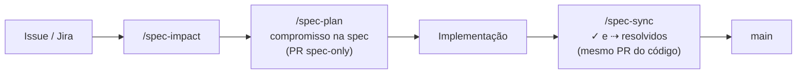

# tabularium3: template de spec viva

Template para manter, dentro do repositório, uma **especificação viva**: o que o produto é, como se comporta e as decisões que o moldaram. A spec anda sincronizada com o código, e cada mudança passa por análise de impacto, compromisso, implementação e sincronização.

O exemplo incluído (`spec/`) é o Iconula, um app de figurinhas da Copa 2026. Substitua-o ao adotar o template.

A spec do próprio tabularium3 (requisitos do template e as decisões que o moldaram) fica em `tabularium-spec/`, com as mesmas convenções. Apague essa pasta ao adotar o template.

## O ciclo



| Na `main`, em `spec/product.md` | Significa |
|---|---|
| `- ✓ texto` | implementado |
| `- texto` | comprometido, ainda não implementado |
| `- ✓ hoje ⇢ desejado` | mudança comprometida sobre algo implementado |

## Estrutura

```
AGENTS.md                       processo (lido por qualquer agente)
spec/AGENTS.md                  regras de formato da spec
spec/product.md                 o que o produto é e como se comporta
spec/config.json                preferências: tracker, padrão de task, camadas, idioma
spec/decisions/<camada>/        uma decisão vigente por arquivo + mapa gerado (README.md)
spec/plans/                     planos por task
scripts/spec.mjs                build-map e check (Node, sem dependências)
.claude/skills/                 spec-init, spec-extract, spec-impact, spec-plan, spec-sync, spec-check, spec-reconcile
.github/workflows/spec-check.yml
```

As instruções ficam só em `AGENTS.md`. Não crie `CLAUDE.md`: quando ele existe, o Claude Code ignora os `AGENTS.md`.

## Adotar

**Projeto novo**: crie o repositório com "Use this template" no GitHub e rode `/spec-init`.

**Repositório existente**: copie para ele `AGENTS.md`, `.gitattributes`, `spec/AGENTS.md`, `scripts/spec.mjs`, `scripts/spec.test.mjs`, `scripts/spec-fixtures/`, `.claude/skills/` e `.github/workflows/spec-check.yml`. Depois rode `/spec-init` e, se já houver código, `/spec-extract`.

Em ambos os casos:
1. Proteja a `main`: exija PR e o check `spec-check` (Settings → Branches ou Rulesets).
2. Crie a label `spec-only`, para PRs que só alteram a spec.

## Comandos

```bash
node scripts/spec.mjs build-map
```

```bash
node scripts/spec.mjs check --base origin/main
```

```bash
node --test scripts/spec.test.mjs
```

Todos aceitam `--spec <pasta>` para operar noutra pasta de spec, como `--spec tabularium-spec`.

O `check` valida o formato do `product.md` e das decisões, verifica se os mapas estão atualizados e lista os `⇢` em aberto. Com `--base`, também confere se o PR que resolve um `⇢` ou altera um item `✓` inclui alteração de código.
