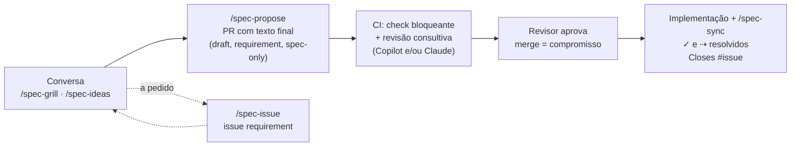

# tabularium3: template de spec viva

Template para manter, dentro do repositório, uma **especificação viva**: o que o produto é, como se comporta e as decisões que o moldaram. A spec anda sincronizada com o código. Cada mudança de requisito amadurece na conversa (e, se preciso, numa issue), vira um PR com o texto final, é aceita no merge e é entregue junto com o código.

O exemplo incluído (`spec/`) é o Iconula, um app de figurinhas da Copa 2026. Substitua-o ao adotar o template.

A spec do próprio tabularium3 (requisitos do template e as decisões que o moldaram) fica em `tabularium-spec/`, com as mesmas convenções. Apague essa pasta ao adotar o template.

## O ciclo



| Na `main`, em `spec/product.md` | Significa |
|---|---|
| `- ✓ texto` | implementado |
| `- texto` | comprometido, ainda não implementado |
| `- ✓ hoje ⇢ desejado` | mudança comprometida sobre algo implementado |

| Label | Uso |
|---|---|
| `requirement` | issue ou PR de proposta de requisito |
| `spec-only` | PR que altera só a spec |
| `spec-mismatch` | PR de código que ajusta uma pequena divergência entre entrega e compromisso |

## Estrutura

```
AGENTS.md                       processo (lido por qualquer agente)
REVIEW.md                       instruções de revisão para agentes revisores (ex.: Copilot code review)
spec/AGENTS.md                  regras de formato e de mudança da spec
spec/product.md                 o que o produto é e como se comporta
spec/config.json                preferências: tracker, padrão de task, camadas, idioma
spec/decisions/<camada>/        uma decisão vigente por arquivo + mapa gerado (README.md)
scripts/spec.mjs                build-map e check (Node, sem dependências)
.claude/skills/                 spec-init, spec-extract, spec-grill, spec-ideas, spec-issue,
                                spec-propose, spec-impact, spec-sync, spec-check, spec-reconcile
.github/workflows/spec-check.yml   check bloqueante + revisão consultiva por agente
.github/ISSUE_TEMPLATE/requirement.yml
```

As instruções ficam só em `AGENTS.md`. Não crie `CLAUDE.md`: quando ele existe, o Claude Code ignora os `AGENTS.md`.

## Adotar

**Projeto novo**: crie o repositório com "Use this template" no GitHub e rode `/spec-init`.

**Repositório existente**: copie para ele `AGENTS.md`, `REVIEW.md`, `.gitattributes`, `spec/AGENTS.md`, `scripts/spec.mjs`, `scripts/spec.test.mjs`, `scripts/spec-fixtures/`, `.claude/skills/`, `.github/workflows/spec-check.yml` e `.github/ISSUE_TEMPLATE/requirement.yml`. Depois rode `/spec-init` e, se já houver código, `/spec-extract`.

O `/spec-init` cria as labels e orienta a configuração da `main`:
- exigir PR e o check `spec-check`;
- exigir branch atualizada antes do merge;
- descartar aprovações quando houver commits novos.

A revisão consultiva por agente é opcional e nunca bloqueia o merge. Pode ser feita por um dos dois, ou pelos dois:
- **Copilot code review**: ruleset com revisão automática e "Review new pushes". Segue o `REVIEW.md` e usa a assinatura do Copilot.
- **Claude**: job `spec-review` do workflow, que roda quando existe o secret `ANTHROPIC_API_KEY`.

## Comandos

```bash
node scripts/spec.mjs build-map
```

```bash
node scripts/spec.mjs check --base origin/main
```

```bash
node --test scripts/spec.test.mjs
```

Todos aceitam `--spec <pasta>` para operar noutra pasta de spec, como `--spec tabularium-spec`.

O `check` valida o formato do `product.md` e das decisões, verifica se os mapas estão atualizados e lista os `⇢` e os itens comprometidos em aberto. Com `--base`, também aplica as regras de PR:
- resolver `⇢` ou marcar `✓` exige código;
- criar, alterar ou desfazer `⇢` exige decisão alterada;
- PR com código não mexe em `⇢` nem em decisões, salvo com `spec-mismatch`.
