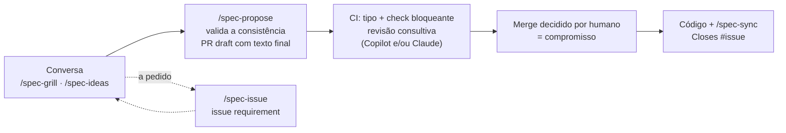

# tabularium3: template de spec viva

Template de repositório que mantém, junto do código, uma **especificação viva** do produto, e um processo apoiado por IA para evoluí-la sem que ela se contradiga. Cada ideia é esmiuçada na conversa, vira proposta só se couber na spec vigente, é reencaixada se a `main` mudar antes do aceite, é aceita no merge e é entregue junto com o código. Serve a equipes que desenvolvem com agentes de IA e querem que spec e código nunca divirjam, nem a spec de si mesma.

## Diferenciais

- A spec cabe no contexto de um agente: arquivos densos, lidos de uma vez ou sob demanda.
- A spec nunca mente sobre o que está implementado: cada item diz se é realidade ou compromisso.
- A spec não se contradiz: nenhuma proposta é publicada sobre uma spec inconsistente.
- Funciona com qualquer agente que leia `AGENTS.md`, sem ferramenta proprietária de agente.
- Verificação automática no PR, sem instalar nada além do Node.
- O processo usa o fluxo git e GitHub que a equipe já tem: issue, PR, label e merge.

## O que vem no repositório

- `spec/`: exemplo incluído, o Iconula (app de figurinhas da Copa 2026). Passa pelas mesmas verificações de um produto e serve para experimentar o ciclo de proposta. Não tem código: a lista de caminhos de código dele é vazia, e a entrega não pode ser experimentada com ele. Substitua-o ao adotar (o `/spec-init` oferece um esqueleto vazio).
- `tabularium-spec/`: a spec do próprio template (requisitos e decisões que o moldaram), no mesmo formato. Junto com tudo o que o template entrega, forma a definição do tabularium, que muda por um fluxo próprio: PR único com a label `tabularium`, sem issue, sem label de tipo e sem entrega separada (ver `tabularium-spec/AGENTS.md`).
- `tabularium-docs/`: documentos derivados da definição, regerados a cada PR `tabularium`. O fluxo completo, com o porquê de cada etapa, está em `tabularium-docs/spec-flow.md`.

Apague `tabularium-spec/` e `tabularium-docs/` ao adotar o template.

## O fluxo



- A ideia amadurece só na conversa; vai para uma issue `requirement` apenas a pedido, como memória entre sessões.
- A proposta traz o texto final da spec e das decisões, sem código, e só é publicada se a spec resultante for consistente.
- O CI deduz o tipo, aplica a label e bloqueia PR inválido; a revisão por agente só comenta. Não há aprovação formal obrigatória.
- A entrega implementa, marca `✓` e resolve `⇢` no mesmo PR do código. Mudança compatível pode vir direto com o código.

### Estado dos itens

Vale em `spec/product.md`, `spec/model.md` e nos documentos técnicos, sempre descrevendo a `main`:

| Item | Estado |
|---|---|
| `- ✓ texto` | implementado: o código faz o que ele diz |
| `- texto` | comprometido: decidido, ainda não implementado |
| `- ✓ hoje ⇢ desejado` | redefinido: vale `hoje` até a entrega de `desejado`; numa remoção, `⇢ (removido)` |

### Tipos de mudança e labels

Todo PR tem um tipo, pelo que faz com a spec vigente; com vários, recebe o maior. O CI deduz o tipo mínimo pelo diff e aplica a label. Quando o diff não mostra se o sentido mudou, a IA julga e vale o maior entre o mínimo e o julgado. Label aplicada por uma pessoa vence, e o CI nunca a troca; sem IA disponível, o caso ambíguo exige label de uma pessoa.

| Label | Uso |
|---|---|
| `spec-editorial` | só texto da spec, sem mudar sentido; único tipo que altera ou marca item `✓` sem código |
| `spec-neutral` | não altera o sentido de nenhum requisito: código sem mudança na spec, ou entrega de compromisso |
| `spec-compatible` | cria requisito, altera item sem `✓` ou o lado direito de um `⇢`, ou cria decisão, sem contradizer item nem decisão vigente |
| `spec-incompatible` | altera o sentido de item `✓`, contradiz item ou vai contra decisão; exige `⇢` e decisão criada ou alterada no mesmo PR |
| `requirement` | issue de requisito |
| `tabularium` | só neste repositório: PR que muda a definição do próprio template, sem label de tipo |

## Skills

Em `.claude/skills/`. Todas seguem `spec/AGENTS.md`.

**Adoção**
- `/spec-init`: cria a estrutura e grava as preferências (camadas, idioma, caminhos de código) em `spec/config.json`; reexecutável, sempre pergunta os caminhos de código se a lista estiver vazia; cria as labels e orienta a proteção da `main` e a revisão consultiva.
- `/spec-extract`: preenche `product.md`, `model.md` e decisões de produto a partir de código, testes e documentação existente; `✓` só com evidência, perguntas durante a extração.

**Amadurecimento** (só na conversa)
- `/spec-grill`: esmiúça a ideia contra glossário, modelo, transversais, decisões e código, em rodadas de perguntas; aponta tipo, cascata, inconsistências e defasagem de proposta.
- `/spec-ideas`: sugere alternativas, cenários de borda, cascata esquecida, riscos e recortes, para aceitar ou descartar com motivo.
- `/spec-issue`: a pedido, leva os resumos da conversa para uma issue `requirement`, nova ou existente.

**Proposta**
- `/spec-propose`: escreve o texto final e as operações nas decisões, valida a consistência da spec resultante e abre ou atualiza o PR de proposta em draft, rebaseando e reencaixando uma proposta defasada.
- `/spec-impact`: análise de impacto de uma issue ou texto; revisão consultiva de um PR de proposta (comentário no PR, no CI ou local); classificação do tipo no caso ambíguo, para o CI. Nunca aprova nem reprova.

**Entrega**
- `/spec-sync`: no PR do código, marca `✓` no entregue, reescreve os `⇢` entregues e trata divergências entre entrega e compromisso.

**Manutenção**
- `/spec-check`: roda o check e revisa o drift entre spec e código, com achados e evidências; só verifica.
- `/spec-reconcile`: restaura a consistência da spec consigo mesma, uma camada por vez, e organiza as decisões; nada muda sem aprovação.

## Estrutura

```
AGENTS.md                          processo (lido por qualquer agente)
REVIEW.md                          instruções para agentes de revisão (ex.: Copilot code review)
.gitattributes                     finais de linha LF
spec/AGENTS.md                     regras de formato e de mudança da spec
spec/product.md                    o que o produto é e como se comporta
spec/model.md                      modelo conceitual (opcional): tipos e entidades do domínio
spec/<camada>.md                   documento técnico de uma camada (opcional)
spec/config.json                   preferências: camadas, idioma, caminhos de código (codePaths)
spec/decisions/<camada>/           uma decisão vigente por arquivo + mapa gerado (README.md)
scripts/spec.mjs                   build-map, classify e check (Node, sem dependências)
scripts/spec.test.mjs              testes do script
scripts/spec-fixtures/             fixtures dos testes
.claude/skills/                    spec-init, spec-extract, spec-grill, spec-ideas, spec-issue,
                                   spec-propose, spec-impact, spec-sync, spec-check, spec-reconcile
.github/workflows/spec-check.yml   tipo, check bloqueante e revisão consultiva por agente
.github/ISSUE_TEMPLATE/requirement.yml   formulário de issue de requisito
tabularium-spec/                   spec do próprio template (apagar ao adotar)
tabularium-docs/                   documentos derivados do template (apagar ao adotar)
```

## Adotar

**Projeto novo**: crie o repositório com "Use this template" no GitHub e rode `/spec-init`.

**Repositório existente**: copie `AGENTS.md`, `REVIEW.md`, `.gitattributes`, `spec/AGENTS.md`, `scripts/spec.mjs`, `scripts/spec.test.mjs`, `scripts/spec-fixtures/`, `.claude/skills/`, `.github/workflows/spec-check.yml` e `.github/ISSUE_TEMPLATE/requirement.yml`. Depois rode `/spec-init` e, se já houver código, `/spec-extract`.

Os caminhos de código (`codePaths` em `spec/config.json`) são as pastas ou arquivos do código do produto (ex.: `src/`, `app/`), casados por prefixo; só o que está neles conta como código nas regras de PR. Configuração, build, instruções de IA, infra e a própria spec ficam de fora. Lista vazia é projeto sem código, como o exemplo; configuração sem a lista é recusada pelo script. O `/spec-init` sugere a lista a partir das pastas do repositório, pergunta-a sempre que estiver vazia e a atualiza quando o código muda de lugar.

O `/spec-init` cria as labels `requirement`, `spec-editorial`, `spec-neutral`, `spec-compatible` e `spec-incompatible`, e orienta a proteção da `main` (Settings → Rules), que você configura:
- exigir PR;
- exigir o check `spec-check`, que deduz o tipo, aplica a label (o workflow tem escrita nos PRs só para isso) e bloqueia quando o tipo torna o PR inválido;
- exigir branch atualizada com a `main` antes do merge;
- aprovação não é necessária: a aceitação é o merge decidido por um humano. Se a equipe exigir aprovação, descarte as aprovações quando houver commits novos.

Revisão consultiva por agente, opcional e nunca bloqueante; um, os dois ou nenhum:
- **Copilot code review**: ruleset da `main` com "Automatically request Copilot code review" e "Review new pushes". Segue o `REVIEW.md` e usa a assinatura do Copilot, sem secret.
- **Claude**: job `spec-review` do workflow, que roda o `/spec-impact` em modo PR nos PRs que tocam `spec/`, quando existe o secret `ANTHROPIC_API_KEY`.

Com o secret `ANTHROPIC_API_KEY`, o check também usa o Claude para classificar o tipo no caso ambíguo. Sem ele, ou em PR de fork, o caso ambíguo exige que uma pessoa aplique a label de tipo.

## Comandos

```bash
node scripts/spec.mjs build-map                      # regera os mapas de decisões
node scripts/spec.mjs check                          # formato, mapas, ⇢ e compromissos em aberto
node scripts/spec.mjs check --base origin/main       # + tipo da mudança e regras de PR
node scripts/spec.mjs classify --base origin/main    # tipo mínimo e pontos ambíguos, em JSON
node --test scripts/spec.test.mjs                    # testes do script
```

Todos os comandos do script aceitam `--spec <pasta>` para operar noutra pasta de spec (padrão: `spec`), como `--spec tabularium-spec`. No CI, o `check` roda também com `--labels <label>` e `--require-type`.

O `check` valida o formato do `product.md`, do `model.md` (inclusive se todo nome em destaque é termo do glossário ou tipo declarado), dos documentos técnicos e das decisões; verifica se os mapas estão atualizados; avisa sobre possíveis referências temporais, termos de implementação no modelo e `CLAUDE.md` presente; e lista os `⇢` e os itens comprometidos em aberto. Com `--base`, deduz o tipo da mudança e aplica as regras de PR:
- label de tipo abaixo do mínimo do diff, ou mais de uma, é erro; com `--require-type`, o caso ambíguo sem label também;
- resolver `⇢` exige código;
- alterar ou marcar `✓` sem código só em PR `spec-editorial`;
- criar, alterar ou desfazer `⇢`, e toda mudança incompatível, exigem decisão criada ou alterada.

## Instruções para agentes

As instruções ficam só em `AGENTS.md` (processo na raiz, regras de formato em `spec/AGENTS.md`). Não crie `CLAUDE.md`: quando ele existe, o Claude Code ignora os `AGENTS.md`.
