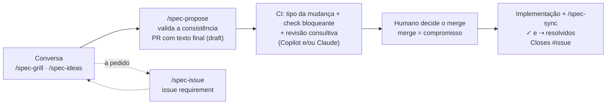

# tabularium3: template de spec viva

Template para manter, dentro do repositório, uma **especificação viva**: o que o produto é, como se comporta e as decisões que o moldaram. Mais do que documentação, é um processo apoiado por IA para que a spec continue sincronizada com o código e **consistente consigo mesma** a cada mudança. Cada ideia é esmiuçada contra a spec vigente na conversa (e, se preciso, numa issue), vira um PR com o texto final só se a spec resultante for consistente, é reencaixada se a `main` mudar antes do aceite, é aceita no merge e é entregue junto com o código.

O exemplo incluído (`spec/`) é o Iconula, um app de figurinhas da Copa 2026. Substitua-o ao adotar o template.

O exemplo também serve para experimentar o ciclo de proposta: passa pelas mesmas verificações de um produto.

A spec do próprio tabularium3 (requisitos do template e as decisões que o moldaram) fica em `tabularium-spec/`, com as mesmas regras de formato. Ela e tudo o que o template entrega formam a definição do tabularium, que muda por um fluxo próprio: PR único com a label `tabularium`, sem issue nem entrega separada (ver `tabularium-spec/AGENTS.md`). Os documentos derivados da definição, como o fluxo completo em `tabularium-docs/spec-flow.md`, são regerados a cada uma dessas mudanças. Apague `tabularium-spec/` e `tabularium-docs/` ao adotar o template.

## O ciclo



| Na `main`, em `spec/product.md`, `spec/model.md` e documentos técnicos | Significa |
|---|---|
| `- ✓ texto` | implementado |
| `- texto` | comprometido, ainda não implementado |
| `- ✓ hoje ⇢ desejado` | redefinido: vale `hoje` até a entrega de `desejado` |

Todo PR tem um **tipo de mudança**, pelo que faz com a spec vigente. O CI deduz o tipo mínimo pelo diff e aplica a label; quando o diff não mostra se o sentido mudou, a IA julga. A label aplicada por uma pessoa vence, e o CI nunca a troca. PR com vários tipos recebe o maior.

| Label | Uso |
|---|---|
| `spec-editorial` | muda só o texto da spec, sem mudar sentido; único tipo que altera ou marca item `✓` sem código |
| `spec-neutral` | não altera o sentido de nenhum requisito: código sem spec, ou entrega de compromisso |
| `spec-compatible` | cria requisito, altera item sem `✓` ou cria decisão, sem contradizer nada; pode vir com o código |
| `spec-incompatible` | altera o sentido de item `✓`, contradiz item ou vai contra decisão: `⇢` e decisão no mesmo PR |
| `requirement` | issue de requisito |
| `tabularium` | só neste repositório: PR que muda a definição do próprio template, sem label de tipo |

## Estrutura

```
AGENTS.md                       processo (lido por qualquer agente)
REVIEW.md                       instruções para agentes de revisão (ex.: Copilot code review)
spec/AGENTS.md                  regras de formato e de mudança da spec
spec/product.md                 o que o produto é e como se comporta
spec/model.md                   modelo conceitual (opcional): tipos e entidades do domínio
spec/<camada>.md                documento técnico de uma camada (opcional)
spec/config.json                preferências: camadas, idioma, caminhos que não são código
spec/decisions/<camada>/        uma decisão vigente por arquivo + mapa gerado (README.md)
scripts/spec.mjs                build-map e check (Node, sem dependências)
.claude/skills/                 spec-init, spec-extract, spec-grill, spec-ideas, spec-issue,
                                spec-propose, spec-impact, spec-sync, spec-check, spec-reconcile
.github/workflows/spec-check.yml   check bloqueante + revisão consultiva por agente
.github/ISSUE_TEMPLATE/requirement.yml
```

As instruções ficam só em `AGENTS.md`. Não crie `CLAUDE.md`: quando ele existe, o Claude Code ignora os `AGENTS.md`.

## Adotar

**Projeto novo**: crie o repositório com "Use this template" no GitHub e rode `/spec-init`.

**Repositório existente**: copie para ele `AGENTS.md`, `REVIEW.md`, `.gitattributes`, `spec/AGENTS.md`, `scripts/spec.mjs`, `scripts/spec.test.mjs`, `scripts/spec-fixtures/`, `.claude/skills/`, `.github/workflows/spec-check.yml` e `.github/ISSUE_TEMPLATE/requirement.yml`. Depois rode `/spec-init` e, se já houver código, `/spec-extract`.

O `/spec-init` cria as labels e orienta a configuração da `main`:
- exigir PR e o check `spec-check`, que deduz o tipo, aplica a label de tipo (o workflow tem permissão de escrita nos PRs só para isso) e bloqueia quando o tipo torna o PR inválido;
- exigir branch atualizada antes do merge;

Não há aprovação formal obrigatória: a aceitação é o merge decidido por um humano. Se a equipe exigir aprovação, descarte as aprovações quando houver commits novos.

A revisão consultiva por agente é opcional e nunca bloqueia o merge. Pode ser feita por um dos dois, ou pelos dois:
- **Copilot code review**: ruleset com revisão automática e "Review new pushes". Segue o `REVIEW.md` e usa a assinatura do Copilot.
- **Claude**: job `spec-review` do workflow, que roda quando existe o secret `ANTHROPIC_API_KEY`.

Com o secret, o check também usa o Claude para classificar o tipo no caso ambíguo. Sem ele, ou em PR de fork, o caso ambíguo exige que uma pessoa aplique a label de tipo.

## Comandos

```bash
node scripts/spec.mjs build-map
```

```bash
node scripts/spec.mjs check --base origin/main
```

```bash
node scripts/spec.mjs classify --base origin/main
```

```bash
node --test scripts/spec.test.mjs
```

Todos aceitam `--spec <pasta>` para operar noutra pasta de spec, como `--spec tabularium-spec`.

O `check` valida o formato do `product.md`, do `model.md` (inclusive se todo nome em destaque é termo do glossário ou tipo declarado), dos documentos técnicos e das decisões, verifica se os mapas estão atualizados e lista os `⇢` e os itens comprometidos em aberto. Com `--base`, também deduz o tipo da mudança e aplica as regras de PR, nos três documentos:
- label de tipo abaixo do mínimo do diff, ou mais de uma, é erro; com `--require-type` (no CI), o caso ambíguo sem label também;
- resolver `⇢` exige código;
- alterar ou marcar `✓` sem código só em PR `spec-editorial`;
- criar, alterar ou desfazer `⇢`, e toda mudança incompatível, exigem decisão criada ou alterada.

O `classify` imprime o tipo mínimo e os pontos ambíguos, em JSON.
