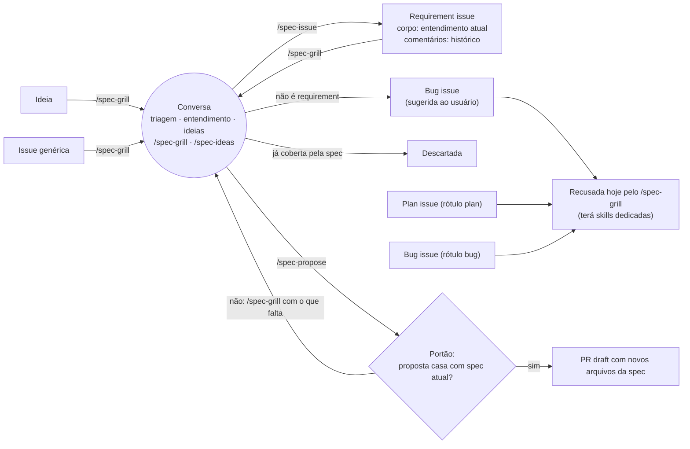
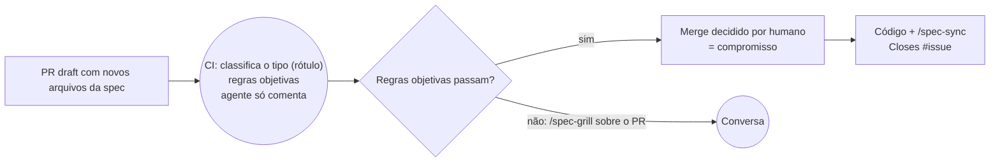

# tabularium3: template de spec viva

Conjunto instalável de regras, instruções, verificação e skills. Ele mantém, junto do código de um repositório, uma **especificação viva** do produto. Também traz um processo apoiado por IA para evoluí-la sem que ela se contradiga.

Cada ideia ou issue é triada contra a spec e discutida até virar uma proposta que casa com a spec vigente. Se a spec vigente mudar antes do aceite, a proposta é casada de novo. No merge, a proposta vira compromisso. Na entrega, a spec volta a refletir o código.

Serve a equipes que desenvolvem com agentes de IA. Elas querem que spec e código nunca divirjam, nem a spec de si mesma.

## Diferenciais

- A spec cabe no contexto de um agente: arquivos densos, lidos de uma vez ou sob demanda.
- A spec nunca mente sobre o que está implementado ou será implantado: cada item diz se é realidade ou compromisso.
- A spec não se contradiz: nenhuma proposta inconsistente é incorporada na spec vigente.
- Só a spec vigente fica no repositório: as ideias amadurecem fora dele, até virarem propostas consistentes com a spec vigente.
- Funciona com qualquer agente que leia `AGENTS.md`, sem ferramenta proprietária de agente.
- O processo se apoia no fluxo git e GitHub que a equipe já usa: issue, PR, rótulo e merge.

## Instalar, configurar e manter

Os detalhes operacionais ficam em `tabularium-docs/`. São documentos derivados: a fonte é a spec do tabularium, e eles são regerados a cada mudança. Em caso de conflito, vale a spec.

- [`install.md`](tabularium-docs/install.md): instalar e atualizar o tabularium num projeto;
- [`config.md`](tabularium-docs/config.md): configurar o projeto (caminhos de código, idioma) e o repositório (rótulos, proteção da `main`, conferência por agente);
- [`maintenance.md`](tabularium-docs/maintenance.md): mudar o próprio tabularium;
- [`spec-flow.md`](tabularium-docs/spec-flow.md): o fluxo completo e o porquê.

## Os documentos da spec

Tudo fica em `spec/`, sempre descrevendo a `main`.

### Requisitos

- `spec/product.md`: o que o produto é e como se comporta, do ponto de vista de quem o usa. Traz o glossário, os requisitos por domínio, as regras transversais, os não funcionais e o fora de escopo. É a fonte da verdade do comportamento.
- `spec/model.md` (opcional): o modelo conceitual do mesmo vocabulário, com tipos, entidades, relações, estados e invariantes. É lido sempre junto do `product.md`.

### Classificação dos itens

Cada item dos requisitos e dos documentos técnicos diz se é realidade ou compromisso:

| Item | Estado |
|---|---|
| `- ✓ texto` | implementado: o código faz o que ele diz |
| `- texto` | comprometido: decidido, ainda não implementado |
| `- ✓ hoje ⇢ desejado` | redefinido: vale `hoje` até a entrega de `desejado`; numa remoção, `⇢ (removido)` |

### Documentos técnicos fundamentais

Descrevem questões fundamentais, cuja alteração depois da adoção causa grande impacto. Seus itens seguem a mesma classificação.

O tabularium não lista quais são: cada projeto define as suas camadas fundamentais, e cada uma tem o seu documento, `spec/<camada>.md`, obrigatório. Por exemplo `spec/architecture.md` (arquitetura), `spec/integration.md` (interfaces com outros sistemas) e `spec/data.md` (modelo de dados).

### Documentos técnicos auxiliares

Descrevem questões complementares, cujo impacto é menor e que podem ser alteradas com mais liberdade.
São independentes das camadas fundamentais e dos requisitos, e podem ser criados ou modificados sem afetar o núcleo do sistema.
Tipicamente descrevem como são realizados os requisitos na prática, detalhando padrões, casos específicos.

São opcionais, e cada um trata de um assunto: por exemplo `spec/interface.md` (telas), `spec/flows.md` (fluxos) e `spec/style.md` (guia de estilo).

### Decisões

`spec/decisions/<camada>/*.md`, uma pasta por camada, e a de `product` (as decisões dos requisitos) é obrigatória, como a de cada camada fundamental. Cada arquivo é uma decisão vigente, com o tema, a escolha, o contexto, as alternativas descartadas, as consequências e o histórico. Decisão que deixa de valer é apagada, e a história fica no git.

## O fluxo

```mermaid
flowchart LR
  ID["Ideia"] -->|"/spec-grill"| C
  IS["Issue genérica"] -->|"/spec-grill"| C
  RI["Requirement issue<br/>corpo: entendimento atual<br/>comentários: histórico"] -->|"/spec-grill"| C
  C(("Conversa<br/>triagem · entendimento · ideias<br/>/spec-grill · /spec-ideas"))
  C -->|"/spec-issue"| RI
  C -->|"não é requirement"| B["Bug issue<br/>(sugerida ao usuário)"]
  C -->|"já coberta pela spec"| X["Descartada"]
  C -->|"/spec-propose"| G{"Portão:<br/>proposta casa com spec atual?"}
  G -->|"não: /spec-grill com o que falta"| C
  G -->|sim| PR["PR draft com novos arquivos da spec"]

  B --> Z["Recusada hoje pelo /spec-grill<br/>(terá skills dedicadas)"]
  PL["Plan issue (rótulo plan)"] --> Z

  BL["Bug issue (rótulo bug)"] --> Z
```

Depois que o PR é aberto:

```mermaid
flowchart LR
  PR["PR draft com novos arquivos da spec"] --> CI(("CI: classifica o tipo (rótulo)<br/>regras objetivas<br/>agente só comenta"))
  CI --> GG{"Regras objetivas passam?"}
  GG -->|sim| A["Merge decidido por humano<br/>= compromisso"]
  GG -->|"não: /spec-grill sobre o PR"| C(("Conversa"))
  A --> E["Código + /spec-sync<br/>Closes #issue"]
```

Duas coisas diferentes carregam a ideia pelo ciclo:
- **A issue** é a discussão em prosa. Ela guarda o amadurecimento, ainda informal, e nada nela é compromisso.
- **O PR** já traz os arquivos da nova spec, redigidos no formato do tabularium. Ele é uma alteração da spec e precisa passar pelo fluxo formal: validação do CI, aceite no merge e entrega.

**1. Tudo começa numa conversa com o agente de IA.** A conversa é o centro do ciclo. Nela entra uma ideia, uma issue aberta por uma pessoa ou uma requirement issue que já existe. Ali o agente tria, entende e amplia a ideia:
- `/spec-grill` faz perguntas até cada ponto estar decidido.
- `/spec-ideas` sugere alternativas, casos de borda e efeitos em cascata.

**2. A triagem descobre o que a ideia é.** O agente compara a issue ou ideia com a spec vigente. O que quem abriu acha que ela é vale só como palpite. Uma issue sem os rótulos `requirement`, `bug` e `plan` ainda não foi triada.

A triagem não é uma etapa. Ela acompanha a conversa. Quando o entendimento amadurece, a IA pode sugerir mudar uma triagem já decidida. Por exemplo, uma issue tida como requirement pode se revelar um bug. A mudança só vale quando uma pessoa a confirma.

A triagem termina em uma de três classificações:

- **Requirement issue** (rótulo `requirement`): pede uma spec nova, alterada ou removida, ou a spec é omissa no assunto. Segue o ciclo abaixo.
- **Bug issue** (rótulo `bug`): o produto contradiz um item que a spec diz estar implementado (`✓`). É um defeito do código, não uma mudança de requisito.
  - Se a origem é uma issue, ela ganha o rótulo `bug`. Se é uma ideia, a issue é criada.
  - Hoje o `/spec-grill` recusa a bug issue e para. Ela terá tratamento próprio, por skills dedicadas, ainda por especificar.
- **Descarte**: a spec já cobre o pedido, mesmo que seja um item comprometido e ainda não implementado.
  - A issue de origem é fechada, com um comentário que aponta o item da spec.
  - Uma ideia é só abandonada.

O `/spec-impact` pode sugerir a classificação. O `/spec-grill` resolve o que ficou incerto com o usuário. Quem decide é uma pessoa, e o rótulo que ela aplica vence. Issue com o rótulo `plan` também é recusada hoje pelo `/spec-grill`. Ela terá tratamento próprio, por skills dedicadas, ainda por especificar.

Os rótulos das issues são aplicados só pela triagem, e uma pessoa pode sempre trocá-los:

| Rótulo | Uso |
|---|---|
| `requirement` | issue triada com ideia de requisito, que segue o ciclo de proposta |
| `bug` | issue triada como divergência do código em relação à spec; hoje recusada pelo `/spec-grill`; terá skills dedicadas |
| `plan` | hoje recusada pelo `/spec-grill`: a issue não segue o ciclo; terá skills dedicadas |

**3. A ideia amadurece, e a issue guarda o que já foi entendido.** Isso é útil quando o usuário decide continuar depois. A conversa não deixa nada no repositório. Para não perder o entendimento entre sessões, o usuário pede `/spec-issue`. Ele guarda tudo numa requirement issue, nova ou existente:
- O corpo é sempre o entendimento mais recente, reescrito só pelo agente.
- Os comentários são o histórico, com um resumo a cada `/spec-issue`.
- Numa issue que uma pessoa já tinha aberto, o texto original vai para o primeiro comentário, com o título `Solicitação original`.

Quando a ideia é retomada, a issue volta para a conversa. As pessoas contribuem comentando.

**4. O portão da proposta.** O portão é a condição para uma conversa virar proposta, ou seja, um PR sobre a spec vigente. O usuário pede `/spec-propose`, que o aplica com o contexto da conversa. O CI reaplica só a parte que consegue conferir sobre o diff. Passa quem cumpre todos estes critérios:

- **Triagem:** a ideia foi triada como requirement issue. Bug e descarte não viram proposta.
- **Nada em aberto:** não resta pergunta necessária sem resposta.
- **Porquê registrado:** cada decisão tem o seu porquê e as alternativas descartadas.
- **Sem contradição:** a spec resultante, com os documentos técnicos fundamentais e as decisões, não se contradiz. Isso vale entre itens, entre documentos, com decisões vigentes e entre um requisito e o fora de escopo.
- **Uma casa por conceito:** nenhum conceito aparece repetido em dois lugares.
- **Vocabulário do glossário:** nenhum termo é usado fora do sentido do glossário, e todo termo do domínio está definido.
- **Cascata completa:** nenhum item depende de outro que não existe ou foi removido.
- **Mudança declarada:** uma mudança só contraria item ou decisão vigente se declarar isso, com `⇢` e uma decisão criada ou alterada.

Uma inconsistência que já existia na spec vigente também impede a proposta. Ela é corrigida antes, num PR próprio.

Se o portão rejeitar, a proposta volta ao passo 1:
- A conversa continua, com o `/spec-grill` em andamento.
- Ele agora traz o que o portão apontou como faltando.

Se o portão aprovar, o `/spec-propose` abre o PR:
- Gera os arquivos atualizados da nova spec, no formato do tabularium.
- Abre um PR em rascunho (draft), com o texto final da spec e das decisões, sem código.
- O autor o libera depois de tratar os comentários do passo 5.

**5. O CI confere o PR de forma independente.** O `/spec-propose` conhece a conversa. O CI não a conhece. Ele só vê o novo texto da spec, nos arquivos ou no diff. É uma segunda conferência, feita apenas sobre a alteração. Ela tem três partes:

- **Classifica a mudança.** Mede o tamanho do impacto, deduz o tipo (editorial, neutra, compatível ou incompatível) e aplica o rótulo correspondente.
- **Aplica regras objetivas e bloqueia o PR que as viola.** São regras que um script confere sem opinião. Por exemplo: uma mudança incompatível sem decisão, ou um rótulo de tipo menor do que a mudança.
- **Pede a opinião de um agente de IA, que só comenta.** O agente procura os mesmos problemas do portão, como contradições, decisões contrariadas e cascata esquecida. Esse comentário nunca bloqueia, porque a IA pode errar e mudar de resposta entre execuções. Ele serve de alerta para quem vai aceitar a proposta.

Os rótulos de PR que o CI aplica dizem o tipo da mudança. Todo PR tem um tipo, pelo que faz com a spec vigente:
- Com vários tipos, vale o maior.
- O CI deduz o tipo mínimo pelo diff. Quando o diff não mostra se o sentido mudou, a IA julga, e vale o maior entre o mínimo e o julgado.
- um rótulo aplicado por uma pessoa vence, e o CI nunca o troca.
- Sem IA disponível, o caso ambíguo exige o rótulo de uma pessoa.

| Rótulo | Uso |
|---|---|
| `spec-editorial` | só texto da spec, sem mudar sentido; único tipo que altera ou marca item `✓` sem código |
| `spec-neutral` | não altera o sentido de nenhum requisito: código sem mudança na spec, ou entrega de compromisso |
| `spec-compatible` | cria requisito, altera item sem `✓` ou o lado direito de um `⇢`, ou cria decisão, sem contradizer item nem decisão vigente |
| `spec-incompatible` | altera o sentido de item `✓`, contradiz item ou vai contra decisão; exige `⇢` e decisão criada ou alterada no mesmo PR |
| `tabularium` | só neste repositório: PR que muda a definição do próprio tabularium, sem rótulo de tipo |

O PR continua em rascunho até o autor liberá-lo. O CI nunca faz isso por ele. Mesmo sem comentários do agente, é o autor que decide que o PR está pronto, depois de ler os comentários e tratar o que julgar necessário.

Não há aprovação formal obrigatória. Quem tem permissão de merge aceita a proposta, e o merge a torna compromisso.

**Os PRs de proposta, de qualquer tipo, formam uma fila de aceite.** Cada PR aberto espera uma decisão: aceitar (merge) ou recusar (fechar sem merge).

Podem existir vários PRs de requisitos ao mesmo tempo. A cada merge, a spec vigente muda. Os PRs que sobraram ficam defasados (drift). Um PR defasado pode deixar de passar nas regras do CI, por exemplo por contradizer o que acabou de ser aceito.

Se um PR não passa nas regras do CI, ele precisa ser rediscutido:
- O usuário roda `/spec-grill` sobre o PR, na conversa, com o que mudou na spec vigente.
- Se a ideia ainda vale, o `/spec-propose` atualiza o PR sobre a spec vigente e o portão é aplicado de novo.
- Se não vale mais, o PR é fechado.

**6. A entrega implementa o compromisso.** O código é escrito no mesmo PR que marca `✓` nos itens entregues e resolve os `⇢`. Esse PR fecha a issue. Uma mudança compatível pode vir direto junto com o código, sem proposta separada.

## Skills

Em `.claude/skills/`. Todas seguem `spec/AGENTS.md`.

- `/spec-init`: depois do INSTALL, prepara o repositório (rótulos e proteção da `main`), grava camadas, idioma e caminhos de código em `spec/config.json`, cria a estrutura da spec e adapta a spec ao formato de uma versão nova; reexecutável.
- `/spec-extract`: preenche `product.md`, `model.md` e decisões de produto a partir de código, testes e documentação existente; `✓` só com evidência, perguntas durante a extração.
- `/spec-grill`: faz a triagem (requirement issue, bug issue ou descarte) e esmiúça a ideia (texto, issue ou proposta) contra glossário, modelo, transversais, decisões e código, em rodadas de perguntas; só na conversa.
- `/spec-ideas`: sugere alternativas, cenários de borda, cascata esquecida e recortes, para aceitar ou descartar com motivo; só na conversa.
- `/spec-issue`: a pedido, leva o entendimento da conversa para uma requirement issue, nova ou existente: reescreve o corpo, comenta o resumo da rodada e, no primeiro toque, guarda o original como comentário.
- `/spec-propose`: aplica o portão da proposta: só se a ideia estiver madura e consistente com a spec vigente escreve o texto final e as operações nas decisões, valida a consistência da spec resultante e abre ou atualiza o PR de proposta em draft, casando de novo uma proposta defasada.
- `/spec-impact`: triagem sugerida (requirement issue, bug issue ou descarte) e impacto de uma issue ou texto; conferência por agente de um PR de proposta; classificação do tipo no caso ambíguo, para o CI. Nunca aprova nem reprova.
- `/spec-sync`: no PR do código, marca `✓` no entregue, reescreve os `⇢` entregues e trata divergências entre entrega e compromisso.
- `/spec-check`: roda o check e revisa o drift entre spec e código, com achados e evidências; só verifica.
- `/spec-reconcile`: restaura a consistência da spec consigo mesma, uma camada por vez, e organiza as decisões; nada muda sem aprovação.

## Instruções para agentes

As instruções ficam só em `AGENTS.md` (processo na raiz, regras de formato em `spec/AGENTS.md`). Não crie `CLAUDE.md`: quando ele existe, o Claude Code ignora os `AGENTS.md`.
