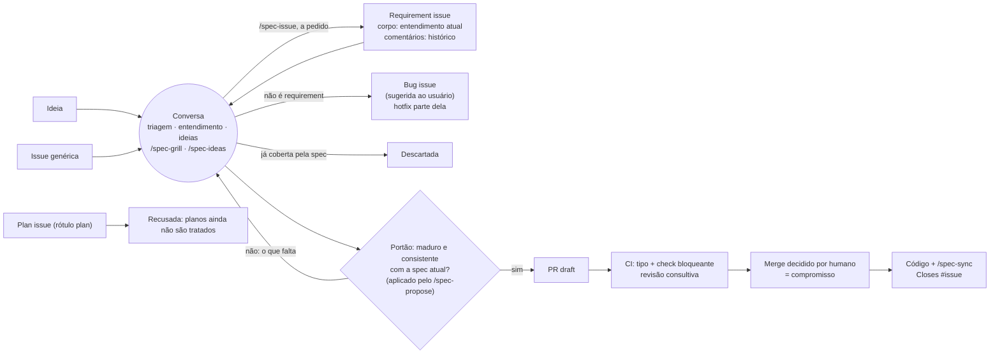

# tabularium3: template de spec viva

Conjunto instalável de regras, instruções, verificação e skills. Ele mantém, junto do código de um repositório, uma **especificação viva** do produto. Também traz um processo apoiado por IA para evoluí-la sem que ela se contradiga. Cada ideia ou issue é triada contra a spec e esmiuçada até virar uma proposta que casa com a spec vigente. Se a spec vigente mudar antes do aceite, a proposta é casada de novo. No merge, a spec continua alinhada com o código. Serve a equipes que desenvolvem com agentes de IA e querem que spec e código nunca divirjam, nem a spec de si mesma.

## Diferenciais

- A spec cabe no contexto de um agente: arquivos densos, lidos de uma vez ou sob demanda.
- A spec nunca mente sobre o que está implementado ou será implantado: cada item diz se é realidade ou compromisso.
- A spec não se contradiz: nenhuma proposta inconsistente é incorporada na spec vigente.
- Só a spec vigente fica no repositório: as ideias amadurecem fora dele, até virarem propostas consistentes com a spec vigente.
- Funciona com qualquer agente que leia `AGENTS.md`, sem ferramenta proprietária de agente.
- O processo se apoia no fluxo git e GitHub que a equipe já usa: issue, PR, label e merge.

## Os documentos da spec

Tudo fica em `spec/`, sempre descrevendo a `main`.

### Requisitos

- `spec/product.md`: o que o produto é e como se comporta, do ponto de vista de quem o usa. Traz o glossário, os requisitos por domínio, as regras transversais, os não funcionais e o fora de escopo. É a fonte da verdade do comportamento.
- `spec/model.md` (opcional): o modelo conceitual do mesmo vocabulário, com tipos, entidades, relações, estados e invariantes. É lido sempre junto do `product.md`.

### Classificação dos itens

Cada item dos requisitos e dos documentos técnicos diz se é realidade ou compromisso:

| Item | Estado |
|---|---|
| `- ✓ texto` | implementado: o código faz o que ele diz |
| `- texto` | comprometido: decidido, ainda não implementado |
| `- ✓ hoje ⇢ desejado` | redefinido: vale `hoje` até a entrega de `desejado`; numa remoção, `⇢ (removido)` |

### Documentos técnicos fundamentais

Descrevem questões fundamentais, cuja alteração depois da adoção causa grande impacto. Seus itens seguem a mesma classificação.

O tabularium não lista quais são: cada projeto define as suas camadas fundamentais, e cada uma tem o seu documento, `spec/<camada>.md`, obrigatório. Por exemplo `spec/architecture.md` (arquitetura), `spec/integration.md` (interfaces com outros sistemas) e `spec/data.md` (modelo de dados).

### Documentos técnicos auxiliares

Descrevem questões complementares, cujo impacto é menor e que podem ser alteradas com mais liberdade.
São independentes das camadas fundamentais e dos requisitos, e podem ser criados ou modificados sem afetar o núcleo do sistema.
Tipicamente descrevem como são realizados os requisitos na prática, detalhando padrões, casos específicos.

São opcionais, um por camada: por exemplo `spec/interface.md` (telas), `spec/flows.md` (fluxos) e `spec/style.md` (guia de estilo).

### Decisões

`spec/decisions/<camada>/*.md`, uma pasta por camada, e a de `product` (as decisões dos requisitos) é obrigatória, como a de cada camada fundamental. Cada arquivo é uma decisão vigente, com o tema, a escolha, o contexto, as alternativas descartadas, as consequências e o histórico. Decisão que deixa de valer é apagada, e a história fica no git.

## O fluxo


```mermaid
flowchart LR
  ID["Ideia"] --> C
  IS["Issue genérica"] --> C
  RI["Requirement issue<br/>corpo: entendimento atual<br/>comentários: histórico"] --> C
  C(("Conversa<br/>triagem · entendimento · ideias<br/>/spec-grill · /spec-ideas"))
  C -->|"/spec-issue, a pedido"| RI
  C -->|"não é requirement"| B["Bug issue<br/>(sugerida ao usuário)<br/>hotfix parte dela"]
  C -->|"já coberta pela spec"| X["Descartada"]
  C --> G{"Portão: maduro e consistente<br/>com a spec atual?<br/>(aplicado pelo /spec-propose)"}
  G -->|"não: o que falta"| C
  G -->|sim| P["PR draft"]
  P --> R["CI: tipo + check bloqueante<br/>revisão consultiva"] --> A["Merge decidido por humano<br/>= compromisso"] --> E["Código + /spec-sync<br/>Closes #issue"]

  PL["Plan issue (rótulo plan)"] --> Z["Recusada: planos ainda não são tratados"]
```

**1. Tudo começa numa conversa com o agente de IA.** A conversa é o centro do ciclo. Nela entra uma ideia, uma issue aberta por uma pessoa ou uma requirement issue que já existe. Ali o agente tria, entende e amplia a ideia:
- `/spec-grill` faz perguntas até cada ponto estar decidido.
- `/spec-ideas` sugere alternativas, casos de borda e efeitos em cascata.

**2. A triagem descobre o que a ideia é.** O agente compara a issue ou ideia com a spec vigente. O que quem abriu acha que ela é vale só como palpite. Uma issue sem os rótulos `requirement`, `bug` e `plan` ainda não foi triada.

A triagem não é uma etapa. Ela acompanha a conversa. Quando o entendimento amadurece, a IA pode sugerir mudar uma triagem já decidida. Por exemplo, uma issue tida como requirement pode se revelar um bug. A mudança só vale quando uma pessoa a confirma.

A triagem termina em uma de três classificações:

- **Requirement issue** (rótulo `requirement`): pede uma spec nova, alterada ou removida, ou a spec é omissa no assunto. Segue o ciclo abaixo.
- **Bug issue** (rótulo `bug`): o produto contradiz um item que a spec diz estar implementado (`✓`). É um defeito do código, não uma mudança de requisito.
  - Se a origem é uma issue, ela ganha o rótulo `bug`. Se é uma ideia, a issue é criada.
  - A correção (hotfix) é um PR de código que parte dessa issue. Ela fica fora do ciclo de proposta e não muda a spec.
- **Descarte**: a spec já cobre o pedido, mesmo que seja um item comprometido e ainda não implementado.
  - A issue de origem é fechada, com um comentário que aponta o item da spec.
  - Uma ideia é só abandonada.

O `/spec-impact` pode sugerir a classificação. O `/spec-grill` resolve o que ficou incerto com o usuário. Quem decide é uma pessoa, e o rótulo que ela aplica vence. Issue com rótulo `plan` é recusada, porque o tratamento de planos ainda não está definido.

**3. A ideia amadurece, e a issue guarda o que já foi entendido.** A issue guarda o amadurecimento em andamento. Isso é útil quando o usuário decide continuar depois. A conversa não deixa nada no repositório. Para não perder o entendimento entre sessões, o usuário pede `/spec-issue`. Ele guarda tudo numa requirement issue, nova ou existente:
- O corpo é sempre o entendimento mais recente, reescrito só pelo agente.
- Os comentários são o histórico, com um resumo a cada `/spec-issue`.
- Numa issue que uma pessoa já tinha aberto, o texto original vai para o primeiro comentário, com o título `Solicitação original`.

Quando a ideia é retomada, a issue volta para a conversa. As pessoas contribuem comentando.

**4. O portão da proposta.** O portão é a condição para uma conversa virar proposta, ou seja, um PR sobre a spec vigente. O usuário pede `/spec-propose`, que aplica o portão. Para passar:
- a triagem precisa ser requirement issue;
- nada necessário pode estar em aberto;
- cada decisão precisa ter o seu porquê;
- a spec resultante não pode ter contradição. Isso inclui os documentos técnicos fundamentais e as decisões.

Uma mudança só pode contrariar a spec vigente se declarar isso, com `⇢` e uma decisão.

Se algo falhar, a rejeição volta ao passo 1. A conversa continua, com o `/spec-grill` em andamento, agora com o que o portão apontou como faltando. Se passar, o PR traz o texto final da spec e das decisões, sem código. Ele nasce em rascunho (draft). O autor o libera depois de tratar a revisão consultiva.

**5. O CI e a pessoa que integra validam.** O CI descobre o tipo da mudança e aplica a label correspondente. Ele bloqueia o PR inválido. A revisão por agente só comenta e nunca bloqueia. Não há aprovação formal obrigatória. Qualquer pessoa com permissão de merge aceita a proposta, e o merge a torna compromisso.

**6. A entrega implementa o compromisso.** O código é escrito no mesmo PR que marca `✓` nos itens entregues e resolve os `⇢`. Esse PR fecha a issue. Uma mudança compatível pode vir direto junto com o código, sem proposta separada.

### Tipos de mudança e labels

Todo PR tem um tipo, pelo que faz com a spec vigente; com vários, recebe o maior. O CI deduz o tipo mínimo pelo diff e aplica a label. Quando o diff não mostra se o sentido mudou, a IA julga e vale o maior entre o mínimo e o julgado. Label aplicada por uma pessoa vence, e o CI nunca a troca; sem IA disponível, o caso ambíguo exige label de uma pessoa.

| Label | Uso |
|---|---|
| `spec-editorial` | só texto da spec, sem mudar sentido; único tipo que altera ou marca item `✓` sem código |
| `spec-neutral` | não altera o sentido de nenhum requisito: código sem mudança na spec, ou entrega de compromisso |
| `spec-compatible` | cria requisito, altera item sem `✓` ou o lado direito de um `⇢`, ou cria decisão, sem contradizer item nem decisão vigente |
| `spec-incompatible` | altera o sentido de item `✓`, contradiz item ou vai contra decisão; exige `⇢` e decisão criada ou alterada no mesmo PR |
| `requirement` | issue triada com ideia de requisito, que segue o ciclo de proposta; aplicada só pela triagem |
| `bug` | issue triada como divergência do código em relação à spec, corrigida por hotfix; aplicada só pela triagem |
| `plan` | reconhecida só para recusa: a issue não segue o ciclo até o tratamento de planos ser definido |
| `tabularium` | só neste repositório: PR que muda a definição do próprio tabularium, sem label de tipo |

## Skills

Em `.claude/skills/`. Todas seguem `spec/AGENTS.md`.

- `/spec-init`: depois do INSTALL, cria a estrutura, grava camadas, idioma e caminhos de código em `spec/config.json`, adapta a spec ao formato de uma versão nova e cria as labels; reexecutável.
- `/spec-extract`: preenche `product.md`, `model.md` e decisões de produto a partir de código, testes e documentação existente; `✓` só com evidência, perguntas durante a extração.
- `/spec-grill`: faz a triagem (requirement issue, bug issue ou descarte) e esmiúça a ideia (texto, issue ou proposta) contra glossário, modelo, transversais, decisões e código, em rodadas de perguntas; só na conversa.
- `/spec-ideas`: sugere alternativas, cenários de borda, cascata esquecida e recortes, para aceitar ou descartar com motivo; só na conversa.
- `/spec-issue`: a pedido, leva o entendimento da conversa para uma requirement issue, nova ou existente: reescreve o corpo, comenta o resumo da rodada e, no primeiro toque, guarda o original como comentário.
- `/spec-propose`: aplica o portão da proposta: só se a ideia estiver madura e consistente com a spec vigente escreve o texto final e as operações nas decisões, valida a consistência da spec resultante e abre ou atualiza o PR de proposta em draft, casando de novo uma proposta defasada.
- `/spec-impact`: triagem sugerida (requirement issue, bug issue ou descarte) e impacto de uma issue ou texto; revisão consultiva de um PR de proposta; classificação do tipo no caso ambíguo, para o CI. Nunca aprova nem reprova.
- `/spec-sync`: no PR do código, marca `✓` no entregue, reescreve os `⇢` entregues e trata divergências entre entrega e compromisso.
- `/spec-check`: roda o check e revisa o drift entre spec e código, com achados e evidências; só verifica.
- `/spec-reconcile`: restaura a consistência da spec consigo mesma, uma camada por vez, e organiza as decisões; nada muda sem aprovação.

## Estrutura

O que o INSTALL leva ao projeto, listado em `tabularium.manifest`, mais o bloco do processo no `AGENTS.md`:

```
AGENTS.md (bloco)                  processo, entre <!-- tabularium:begin --> e <!-- tabularium:end -->
spec/AGENTS.md                     regras de formato e de mudança da spec
REVIEW.md                          instruções para agentes de revisão (ex.: Copilot code review)
scripts/spec.mjs                   build-map, classify e check (Node, sem dependências)
.github/workflows/spec-check.yml   tipo, check bloqueante e revisão consultiva por agente
.github/ISSUE_TEMPLATE/issue.yml  formulário único de issue (palpite e descrição obrigatórios; não aplica rótulo)
.claude/skills/                    as dez skills, com os esqueletos de product.md e model.md do /spec-init
.tabularium                        gerado pelo INSTALL: origem, versão e arquivos instalados
```

O que é do projeto, criado pelo `/spec-init` e pelo trabalho na spec, e que o INSTALL nunca toca:

```
spec/product.md                    o que o produto é e como se comporta
spec/model.md                      modelo conceitual (opcional): tipos e entidades do domínio
spec/<camada>.md                   documento técnico de uma camada (opcional)
spec/config.json                   preferências: camadas, idioma, caminhos de código (codePaths)
spec/locales/<idioma>.json         textos da verificação para idioma não embutido no script (opcional)
spec/decisions/<camada>/           uma decisão vigente por arquivo + mapa gerado (README.md)
```

O que fica só neste repositório e nunca chega aos projetos:

```
tabularium-spec/                   spec do próprio tabularium (requisitos e decisões que o moldaram)
tabularium-docs/                   documentos derivados, como spec-flow.md (o fluxo com o porquê de cada etapa)
README.md                          este arquivo
scripts/spec.test.mjs, scripts/spec-fixtures/   testes do script
.github/workflows/tabularium.yml   CI da definição do tabularium
INSTALL.sh, INSTALL.ps1, tabularium.manifest    instalação
.gitattributes                     finais de linha LF (cada projeto mantém o seu)
```

## Instalar e atualizar

Na raiz do repositório do projeto, com git:

```bash
curl -fsSL https://raw.githubusercontent.com/useful-toys/Tabularium/main/INSTALL.sh | sh
```

```powershell
irm https://raw.githubusercontent.com/useful-toys/Tabularium/main/INSTALL.ps1 | iex
```

O mesmo comando instala e atualiza:
- baixa a última tag `vX.Y.Z` publicada, ou a pedida, e copia os arquivos do manifesto dela, sobrescrevendo;
- apaga os arquivos da instalação anterior que saíram do manifesto;
- no `AGENTS.md`: sem ele, cria-o só com o bloco do processo; com ele, troca só o bloco entre os marcadores, ou o insere no início se não houver, sem tocar o resto;
- grava em `.tabularium` a origem, a versão e os arquivos instalados;
- recusa instalar enquanto existir `CLAUDE.md` na raiz ou em `spec/`: migre o conteúdo para `AGENTS.md` à mão e apague-o;
- recusa voltar para versão menor que a instalada;
- nunca faz commit.

Variáveis opcionais (no PowerShell, `$env:NOME = 'valor'` antes do comando):

| Variável | Efeito |
|---|---|
| `TABULARIUM_VERSION=v1.2.0` | tag a instalar (padrão: a última `vX.Y.Z`) |
| `TABULARIUM_SOURCE=<url git>` | repositório de origem (padrão: o do `.tabularium`, ou o oficial) |
| `TABULARIUM_ALLOW_DOWNGRADE=1` | permite instalar tag menor que a instalada |

Depois, rode `/spec-init`: na adoção, cria a estrutura e as preferências; numa atualização, adapta a spec ao formato novo sem mudar o sentido de nenhum item (o que mudaria sentido vira proposta). Se o repositório já tiver código, siga com `/spec-extract`. Revise o diff e leve tudo, instalação e adaptação, num PR.

Customizações nos arquivos do tabularium se perdem a cada atualização; o que é do projeto fica fora deles.

### Versões

Tags `vX.Y.Z`, criadas à mão por uma pessoa quando decide publicar um lote de mudanças; sem tag, o INSTALL não tem o que instalar. A versão maior muda quando a spec dos projetos precisa ser adaptada ao formato, e o INSTALL avisa ao cruzá-la.

## Configuração

Em `spec/config.json`, alterado só pelo `/spec-init`, que pode ser refeito a qualquer momento.

**Caminhos de código** (`codePaths`): as pastas ou arquivos do código do produto (ex.: `src/`, `app/`), casados por prefixo; só o que está neles conta como código nas regras de PR. Configuração, build, instruções de IA, infra e a própria spec ficam de fora. Lista vazia é projeto sem código, como um projeto sem código, e é perguntada de novo a cada `/spec-init`; configuração sem a lista é recusada pelo script. O `/spec-init` sugere a lista a partir das pastas do repositório e a atualiza quando o código muda de lugar.

**Idioma**: estrutura sempre em inglês; conteúdo no idioma configurado. O script traz embutidos os textos da verificação em `pt-BR`; outro idioma recebe os textos em `spec/locales/<idioma>.json`, com as mesmas chaves, criado pelo `/spec-init`. O script nunca é editado no projeto. Idioma novo vale para conteúdo novo; o existente só é traduzido a pedido.

## Proteção da `main` e revisão consultiva

O `/spec-init` cria as labels `requirement`, `bug`, `spec-editorial`, `spec-neutral`, `spec-compatible` e `spec-incompatible`, e orienta a proteção da `main` (Settings → Rules), que você configura:
- exigir PR;
- exigir o check `spec-check`, que deduz o tipo, aplica a label (o workflow tem escrita nos PRs só para isso) e bloqueia quando o tipo torna o PR inválido;
- exigir branch atualizada com a `main` antes do merge;
- aprovação não é necessária: a aceitação é o merge decidido por um humano. Se a equipe exigir aprovação, descarte as aprovações quando houver commits novos.

Revisão consultiva por agente, opcional e nunca bloqueante; um, os dois ou nenhum:
- **Copilot code review**: ruleset da `main` com "Automatically request Copilot code review" e "Review new pushes". Segue o `REVIEW.md` e usa a assinatura do Copilot, sem secret.
- **Claude**: job `spec-review` do workflow, que roda o `/spec-impact` em modo PR nos PRs que tocam `spec/`, quando existe o secret `ANTHROPIC_API_KEY`.

Com o secret, o check também usa o Claude para classificar o tipo no caso ambíguo. Sem ele, ou em PR de fork, o caso ambíguo exige que uma pessoa aplique a label de tipo.

## Comandos

```bash
node scripts/spec.mjs build-map                      # regera os mapas de decisões
node scripts/spec.mjs check                          # formato, mapas, ⇢ e compromissos em aberto
node scripts/spec.mjs check --base origin/main       # + tipo da mudança e regras de PR
node scripts/spec.mjs classify --base origin/main    # tipo mínimo e pontos ambíguos, em JSON
node --test scripts/spec.test.mjs                    # testes do script (só neste repositório)
```

Todos os comandos do script aceitam `--spec <pasta>` (padrão: `spec`), como `--spec tabularium-spec`. No CI, o `check` roda também com `--labels <label>` e `--require-type`.

O `check` valida o formato do `product.md`, do `model.md` (inclusive se todo nome em destaque é termo do glossário ou tipo declarado), dos documentos técnicos e das decisões; verifica se os mapas estão atualizados; avisa sobre possíveis referências temporais, termos de implementação no modelo e `CLAUDE.md` presente; e lista os `⇢` e os itens comprometidos em aberto. Com `--base`, deduz o tipo da mudança e aplica as regras de PR:
- label de tipo abaixo do mínimo do diff, ou mais de uma, é erro; com `--require-type`, o caso ambíguo sem label também;
- resolver `⇢` exige código;
- alterar ou marcar `✓` sem código só em PR `spec-editorial`;
- criar, alterar ou desfazer `⇢`, e toda mudança incompatível, exigem decisão criada ou alterada.

## Mudar o próprio tabularium

A definição do tabularium é `tabularium-spec/` junto com os arquivos deste repositório. Muda por PR único com a label `tabularium`, sem issue, sem label de tipo e sem entrega separada, já com spec, decisões, arquivos, `README.md` e `tabularium-docs/` alinhados; o CI em `tabularium.yml` exige a label em todo PR que toca a definição. Detalhes em `tabularium-spec/AGENTS.md`.

## Instruções para agentes

As instruções ficam só em `AGENTS.md` (processo na raiz, regras de formato em `spec/AGENTS.md`). Não crie `CLAUDE.md`: quando ele existe, o Claude Code ignora os `AGENTS.md`.
