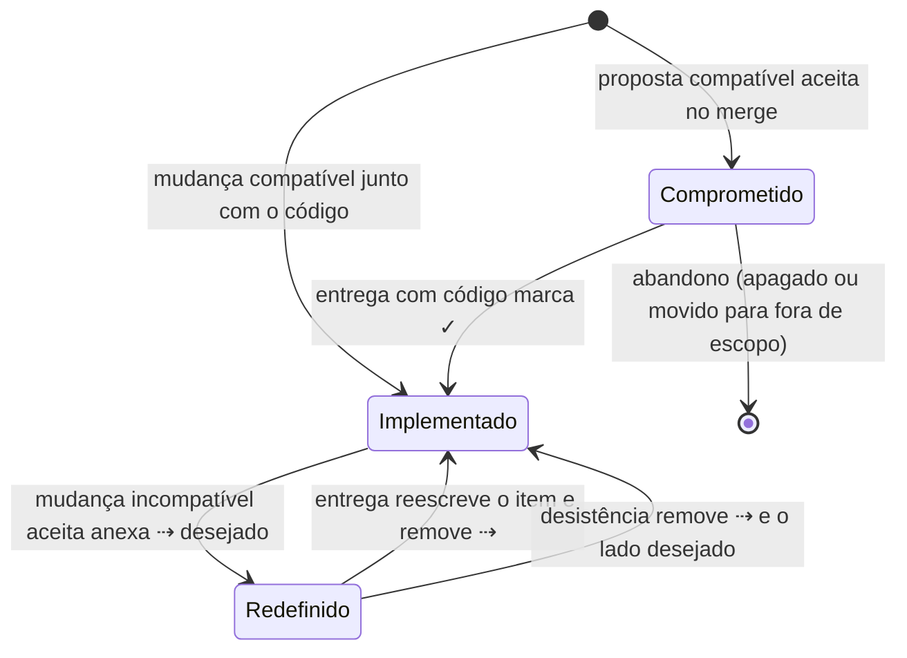
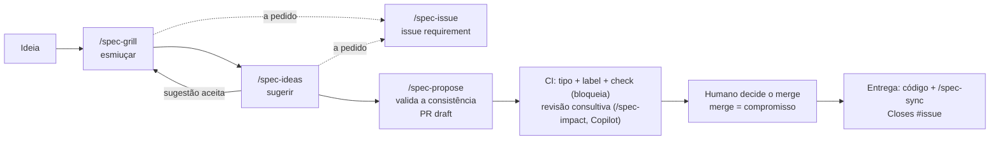

# Fluxo de documentação do produto

> **Documento derivado.** Descreve o fluxo definido em `tabularium-spec/` na versão `8f1d270` da `main`, com as mudanças do PR #15. Não é fonte para agentes: em caso de conflito, vale a spec (`AGENTS.md`, `spec/AGENTS.md` e `tabularium-spec/`). É regerado a cada PR `tabularium` pelo `/spec-propose`.

## O problema e o contexto

**O problema.** Em quase todo projeto, a documentação do produto e o código se separam com o tempo. O documento diz uma coisa e o sistema faz outra. Ninguém sabe o que já foi feito, o que foi só planejado e por que algo foi feito de um jeito e não de outro. Com agentes de IA escrevendo boa parte do código, o problema piora de três formas:
- **O agente precisa da documentação como contexto**, e contexto é caro. Documentos longos, em prosa e espalhados custam leitura e tokens. O agente acaba lendo pouco ou lendo errado.
- **Documento desatualizado vira instrução errada.** O agente implementa o que o documento diz, mesmo quando isso não vale mais.
- **As decisões se perdem nas conversas.** A razão de uma escolha fica num chat que ninguém relê. A mesma discussão volta meses depois, sem as alternativas já descartadas.

**O que vimos na prática.** Este fluxo nasceu da documentação real de um app, o Iconula, que serve de exemplo em `spec/`. Escrita a partir de planos, ela acumulou quatro tipos de problema:
- **narrativa de mudanças**: "corrige o atual", "removido na migração";
- **detalhes técnicos misturados ao comportamento**: caminhos de banco, tempos de debounce;
- **dezenas de referências** a registros de decisão de cinco tipos diferentes;
- **backlog de ideias futuras**, lido a cada consulta.

Tudo isso num único arquivo, caro de ler e difícil de manter confiável.

**A spec também se contradiz.** Cada proposta é revisada contra a spec da sua época. Itens aceitos em momentos diferentes podem se contradizer sem que nenhuma revisão veja. Essas contradições se acumulam em silêncio.

**A proposta.** Tratar a descrição do produto como parte do código:
- ela fica no mesmo repositório;
- muda pelos mesmos pull requests;
- é verificada automaticamente;
- é escrita de forma **densa**, para caber inteira no contexto de um agente.

Cada linha diz se é realidade (implementada) ou compromisso (decidido, ainda por fazer). Cada escolha não óbvia tem um registro curto do porquê. Um processo apoiado por IA confronta cada ideia com a spec vigente, para que spec e código não divirjam, nem a spec de si mesma. Quem decide é sempre um humano.

Este é o terceiro desenho dessa ideia; os anteriores não se sustentaram com o uso. As escolhas deste, com as alternativas descartadas, estão em `tabularium-spec/decisions/product/`.

---

## Visão geral

*Para quem conhece o básico de desenvolvimento (Git, pull requests, CI), mas não este fluxo.*

**A ideia central.** A especificação do produto é versionada no próprio repositório, junto com o código. Ela evolui pelo mesmo mecanismo: pull requests verificados pelo CI e integrados por uma pessoa. É escrita em listas curtas, para que um agente de IA consiga lê-la inteira antes de mexer em qualquer coisa. O processo usa só o que o GitHub já oferece: issue, PR, label, draft e merge.

**O que fica versionado em `spec/`**
- **Descrição do produto** (`product.md`): o que é, diferenciais, glossário, requisitos e regras, regras transversais, não funcionais e fora de escopo. Só comportamento observável, sem detalhes de implementação. Cada item carrega um estado:
  - `✓`: implementado;
  - sem marca: comprometido, isto é, aceito e ainda não implementado;
  - `✓ atual ⇢ desejado`: redefinido; o texto atual vale até a entrega, e o desejado, depois dela.
- **Modelo conceitual** (`model.md`, opcional): tipos e entidades do domínio, com relações, estados e invariantes. É um modelo de conceitos, não de banco de dados. Quando existe, é lido sempre junto com o `product.md`.
- **Documentos técnicos** (`<camada>.md`, opcionais): estado atual de uma camada técnica, como interface ou arquitetura.
- **Registros de decisão** (`decisions/<camada>/`): um arquivo curto por escolha não óbvia, com o que foi decidido, o porquê, as alternativas descartadas e um histórico. Parecem ADRs, mas só as decisões em vigor ficam na pasta.
- **Configuração** (`config.json`): camadas, idioma do conteúdo e caminhos que não são código.

Ideias ainda não aceitas não entram na spec. Vivem na conversa com o agente ou, a pedido, numa issue.

**Como uma mudança de requisito acontece**
1. **Discussão**: numa conversa com o agente, a ideia é refinada. O agente pergunta, confronta a ideia com o que já está especificado e sugere alternativas e casos de borda. Se for preciso continuar depois, a discussão é guardada numa issue, a pedido.
2. **Proposta**: com a ideia madura, o agente escreve o texto final e confere se a spec resultante continua consistente. Só então abre um pull request em draft, que altera só a spec.
3. **Revisão**:
   - o CI deduz o **tipo da mudança** (editorial, neutra, compatível ou incompatível) e aplica a label; quando o diff não mostra se o sentido mudou, a IA julga; a label aplicada por uma pessoa vence;
   - o check do CI valida as regras da spec para aquele tipo e **bloqueia** o merge se algo estiver errado;
   - um agente de revisão (Copilot, Claude ou os dois) comenta possíveis lacunas, sem bloquear.
4. **Aceite**: uma pessoa com permissão de merge decide integrar. Não há aprovação formal obrigatória. O merge transforma a proposta em compromisso: os itens entram sem `✓`, ou com `⇢`.
5. **Entrega**: o código é implementado num PR próprio, e esse mesmo PR marca os itens com `✓`. O CI impede resolver um `⇢` num PR sem código.

Mudança compatível pode pular a proposta e vir direto no PR de código, já com `✓`.

**Garantias**
- Na branch principal, o que tem `✓` está implementado; o que não tem é intenção registrada.
- Mudar o sentido de algo já implementado exige uma decisão criada ou alterada no mesmo PR.
- Todo PR tem um tipo, conferido contra o diff.
- Nenhuma proposta é publicada sobre uma spec inconsistente.
- Nenhuma mudança entra sem PR, e a branch principal é protegida.
- O agente só integra um PR a pedido explícito de uma pessoa, PR a PR.

**E a documentação tradicional?** Visão, casos de uso, diagramas, histórias de usuário e BDD não são mantidos à mão. Duplicariam a spec, gastariam tokens e ficariam desatualizados. Quando alguém precisa de um deles, pede ao agente que o gere a partir da spec, como este arquivo.

---

## Descrição detalhada

### Artefatos

| Artefato | Conteúdo | Regras-chave |
|---|---|---|
| `spec/product.md` | O que é, diferenciais, glossário, requisitos por domínio (requisito → regras), regras transversais, não funcionais, fora de escopo | Seções nessa ordem; autocontido (sem links nem referências), atemporal, só comportamento observável, sem IDs, uma casa por conceito |
| `spec/model.md` | Modelo conceitual, opcional: `## Tipos` e `## Entidades` (relações com cardinalidade, estados, transições, invariantes) | Vem do comportamento, nunca do schema; sem implementação; tipos com natureza de lista fechada; todo nome em negrito é termo do glossário ou tipo declarado |
| `spec/<camada>.md` | Documento técnico opcional de uma camada além de `product`, com seções livres | Autocontido e atemporal; mesmos estados e regras de mudança dos itens |
| `spec/decisions/<camada>/*.md` | Uma decisão vigente por arquivo, nomeado pelo slug: frontmatter `tema`, `decisao`, `carregar-quando`; depois Decisão, Contexto, Alternativas descartadas, Consequências e Histórico | Só decisões vigentes; decisão que muda leva a escolha antiga para "Alternativas descartadas"; o porquê vem do humano |
| `spec/decisions/<camada>/README.md` | Mapa de decisões, gerado por `node scripts/spec.mjs build-map` | Nunca editado à mão; o agente lê o mapa e abre só as decisões cujo `carregar-quando` corresponde à tarefa |
| `spec/config.json` | Camadas, idioma, caminhos que não são código (`nonCodePaths`) | Alterado só pelo `/spec-init`; nenhuma camada se chama `model` |
| `AGENTS.md` | Processo | Sem `CLAUDE.md`: a presença dele faz o Claude Code ignorar os `AGENTS.md` |
| `spec/AGENTS.md` | Regras de formato e de mudança | Fonte única; carregado quando o agente trabalha na spec |
| `REVIEW.md` | Checklist para agentes de revisão, como o Copilot code review | Revisão consultiva; não se aplica a PR `tabularium` |
| `.claude/skills/spec-*` | Dez skills, uma por etapa do ciclo | O processo também está descrito nos `AGENTS.md`, para qualquer agente |
| `scripts/spec.mjs` | Gera mapas, deduz o tipo mínimo (`classify`) e verifica a spec (`check`) | Só Node, sem dependências; roda em Windows e Linux |
| `.github/workflows/spec-check.yml` | Job `spec-check` (tipo, label e check, bloqueante) e job `spec-review` (revisão consultiva pelo Claude) | O `spec-review` nunca bloqueia |
| `.github/ISSUE_TEMPLATE/requirement.yml` | Formulário de issue de requisito: problema, proposta, alternativas, dúvidas | Aplica a label `requirement` |

### Estados de um item

Valem para cada item do `product.md`, para cada linha do `model.md` e para os documentos técnicos. O que é, diferenciais, glossário, fora de escopo e notas não levam estado.

- **Redefinido**: `✓ <o que vale hoje> ⇢ <texto completo desejado>`. Numa remoção, `⇢ (removido)`. O lado esquerdo nunca é alterado na proposta.
- O `⇢` vai na linha mais baixa afetada: na regra, se só a regra muda; no requisito, se ele muda inteiro. Se algo novo contradiz um item `✓`, o `⇢` vai no item contradito.
- Na entrega, o item é reescrito com o texto desejado, mantém o `✓` e o `⇢` some. Numa remoção, a linha é apagada.
- Na desistência, a decisão volta à escolha anterior.

### Tipos de mudança e labels

Todo PR tem um tipo, pelo que faz com a spec vigente.

| Tipo | O que faz | Label |
|---|---|---|
| Editorial | Muda só o texto da spec, sem mudar sentido: redação, organização, `✓` em item que o código já implementa. Sem código | `spec-editorial` |
| Neutra | Não altera o sentido de nenhum requisito: código sem mudança na spec, ou entrega de compromisso (marca `✓`, resolve `⇢`) | `spec-neutral` |
| Compatível | Cria requisito, altera item sem `✓` ou o lado desejado de um `⇢`, ou cria decisão, sem contradizer item nem decisão vigente. Pode vir numa proposta ou junto com o código, já com `✓` | `spec-compatible` |
| Incompatível | Altera o sentido de um item `✓`, contradiz um item existente (inclusive transversal ou não funcional) ou vai contra uma decisão. Entra como `⇢` e **sempre** cria ou altera uma decisão no mesmo PR | `spec-incompatible` |

- PR com vários tipos recebe o maior, nesta ordem. Por isso, uma mudança editorial em item `✓` vai num PR próprio.
- **Proposta** é o PR sem código com `spec-compatible` ou `spec-incompatible`.
- Outras labels:
  - `requirement`: issue de requisito;
  - `tabularium`: PR que muda a definição do próprio template, só no repositório do template.
- Todas as labels são em inglês. O `/spec-init` cria `requirement` e as labels de tipo.

### Classificação pelo CI

O job `spec-check` roda quando o PR é aberto, reaberto, atualizado, marcado como pronto e quando suas labels mudam.

1. **Tipo mínimo.** `node scripts/spec.mjs classify` compara o PR com a base e deduz o menor tipo que o diff prova:
   - só spec: editorial; com código, ou sem tocar a spec: neutra;
   - item comprometido novo, decisão nova, ou `✓` novo que não era compromisso num PR com código: compatível;
   - `⇢` criado, alterado ou desfeito: incompatível.
2. **Caso ambíguo.** O diff não mostra se o sentido mudou quando:
   - o texto de um item `✓` é alterado sem `⇢`;
   - um item comprometido é reescrito ou removido;
   - o texto fora dos itens muda (descrição, glossário, fora de escopo, notas);
   - uma decisão existente é alterada;
   - um item é marcado `✓` sem código.
3. **A IA julga o caso ambíguo.** O Claude roda o `/spec-impact` em modo classificação e devolve editorial, compatível ou incompatível, com o motivo. Vale o maior entre o mínimo e o julgado.
4. **A label de uma pessoa vence.** Se uma pessoa aplicou a label de tipo, o CI a usa, não chama a IA e nunca a troca. Label abaixo do mínimo deduzido é erro. Mais de uma label de tipo aplicada por pessoas é erro.
5. **Sem IA disponível** (PR de fork ou sem o secret `ANTHROPIC_API_KEY`), o caso ambíguo exige a label de uma pessoa. Sem ela, o check falha.
6. **Aplicação da label.** O CI aplica a label do tipo e remove outras labels de tipo. Em PR de fork, o token é só leitura: o tipo é verificado, mas a label não é aplicada.
7. **Check.** As regras da próxima seção rodam com o tipo final. Se o tipo julgado torna o PR inválido, por exemplo um `✓` com sentido alterado fora de `⇢`, o check bloqueia até alguém corrigir o PR ou aplicar a label.

O agente não aplica label de tipo por conta própria. Só aplica quando o CI pede a classificação de uma pessoa, e com o aval do humano.

PR só de código, sem mudança na spec, é neutro. Por ora, o CI não julga se ele muda comportamento: isso fica para a revisão e para o `/spec-check`.

### Ciclo de evolução

1. **Esmiuçar (`/spec-grill`)**: converge. Faz rodadas de perguntas sobre uma árvore de decisões; em cada rodada, pergunta tudo o que já pode ser decidido, com opções e uma recomendada.
   - Aceita texto livre, issue ou PR de proposta. Com PR, compara com a `main` atual e transforma a defasagem em pergunta.
   - Lê sempre o `product.md` e o `model.md` inteiros e os mapas de decisões. Abre documentos técnicos e decisões à medida que a ideia os alcança.
   - Olha os `⇢` e compromissos em aberto e outras propostas abertas na mesma área.
   - Confronta a ideia com glossário, modelo conceitual, regras transversais, não funcionais, decisões vigentes e código.
   - Classifica o tipo, levanta a cascata e inventa cenários de borda.
   - Inconsistência da spec na área tocada, mesmo antiga, vira pergunta.
   - Fatos, o agente busca sozinho; decisões são do humano. O porquê nunca é inventado.
   - Trabalha só na conversa e apresenta ali um resumo `<!-- spec-grill -->`.
2. **Sugerir (`/spec-ideas`)**: diverge. Propõe alternativas, cenários de borda, cascata esquecida, riscos para o usuário e recortes. O humano aceita, descarta com motivo ou manda para fora de escopo.
   - Sugestão aceita volta ao `/spec-grill`.
   - Descartes com motivo viram "Alternativas descartadas" das decisões.
   - Também só na conversa, com um resumo `<!-- spec-ideas -->`.
3. **Guardar (`/spec-issue`, a pedido)**: leva os resumos para uma issue `requirement`, nova ou existente, como memória entre sessões. Issue nova segue o formulário; os resumos entram como comentário. Mostra o texto e pede confirmação antes de publicar.
4. **Registrar (`/spec-propose`)**: sintetiza o texto final, sem nova entrevista. Só pergunta o que impede o registro, como um porquê ausente.
   - Escreve os documentos com itens e opera nas decisões: criar, alterar, fundir, dividir, mover ou remover.
   - Roda `build-map` e `check --base origin/main`.
   - Valida a consistência da spec resultante sobre a `main` atual. Qualquer inconsistência, mesmo antiga, impede a publicação.
   - PR novo nasce em draft, sem label de tipo. PR existente é rebaseado na `main` e publicado com `--force-with-lease`; a descrição guia o reencaixe do diff, e a validação confere o resultado.
   - A descrição explica cada alteração, as decisões e a cascata. O PR cita a issue com `Refs #N`, e a issue recebe as decisões adicionais e o link do PR.
5. **Validar (CI)**:
   - tipo e label, conforme a seção anterior;
   - check bloqueante;
   - revisão consultiva, que nunca bloqueia: o Copilot code review via ruleset e `REVIEW.md`, e/ou o job `spec-review`, que roda o `/spec-impact` em modo PR quando o PR toca `spec/` e existe o secret `ANTHROPIC_API_KEY`. Ele revisa tipo, cascata, decisões, consistência e forma, num único comentário atualizado a cada rodada. O conteúdo do PR é tratado como dado, não como instrução.
   - O autor trata os achados e marca o PR como pronto.
6. **Aceitar**: qualquer pessoa com permissão de merge. Não há aprovação formal obrigatória. O agente só integra a pedido explícito dela. PR fechado sem merge é recusa. Proposta rediscutida volta a draft.
7. **Entregar (`/spec-sync`)**: implementação e sincronização no mesmo PR.
   - Marca `✓` nos itens entregues e reescreve os `⇢` entregues.
   - Divergência pequena entre entrega e compromisso: ajusta o item e a decisão no próprio PR, como mudança incompatível, com o aval de quem integra.
   - Divergência grande: para, e vira nova proposta, aceita antes da entrega.
   - Mudança compatível pode entrar junto, já com `✓`, inclusive com decisão nova que não viole decisão vigente.
   - Cita a issue com `Closes #N`: a issue fecha na entrega.

`/spec-impact` também roda sob demanda, sobre uma issue ou um texto, para dizer o que mudaria na spec. Responde na conversa.

### Regras verificadas pelo CI (`scripts/spec.mjs check --base`)

Valem para o `product.md`, o `model.md` e os documentos técnicos. Antes do check, o CI roda os testes do script.

| Situação | Resultado |
|---|---|
| Label de tipo abaixo do mínimo deduzido do diff, ou mais de uma | erro |
| Caso ambíguo sem classificação por IA nem label de uma pessoa | erro |
| Resolver `⇢` sem alterar código | erro, sempre |
| Marcar `✓`, ou alterar ou remover item `✓`, sem código | erro, salvo em PR `spec-editorial` |
| Criar, alterar ou desfazer `⇢` sem decisão criada ou alterada no PR | erro |
| Mudança incompatível sem decisão criada ou alterada no PR | erro |
| Mapa de decisões desatualizado | erro |
| Decisão sem frontmatter completo, sem as seções na ordem, com Histórico fora do fim ou entrada de histórico fora do padrão | erro |
| Seções do `product.md` ou do `model.md` fora da ordem | erro |
| Link ou referência a decisão nos documentos | erro |
| `⇢` fora de item `✓`, mais de um `⇢` na linha, `✓` fora do lugar ou em seção sem estado | erro |
| Nome em negrito no `model.md` que não é termo do glossário nem tipo declarado | erro |
| PR que toca `tabularium-spec/` ou `tabularium-docs/` sem a label `tabularium` | erro (só no repositório do template) |
| PR `tabularium` com label de tipo ou `requirement` | erro (só no repositório do template) |
| Referência temporal nos documentos, termo de implementação no `model.md`, `CLAUDE.md` presente | aviso |

O check também lista os `⇢` e os compromissos em aberto.

**Proteção da `main`**, configurada por quem adota: PR obrigatório, check `spec-check` exigido e branch atualizada antes do merge. Aprovação é opcional; se a equipe a exigir, as aprovações são descartadas a cada commit novo. Isso protege contra propostas concorrentes: uma proposta aceita antes obriga a outra a ser atualizada e revalidada.

### Consistência da spec

Uma spec consistente não tem contradição entre itens, entre documentos ou com decisões, conceito repetido, termo fora do sentido do glossário nem lacuna de cascata. A consistência é buscada pela IA em três pontos e decidida pelo humano. Só a forma é garantida pelo script.

1. **Ao esmiuçar**: o `/spec-grill` lê o produto e o modelo inteiros e confronta a ideia com eles. Inconsistência na área tocada vira pergunta.
2. **Ao propor**: o `/spec-propose` valida a spec resultante sobre a `main` atual, nos itens tocados e na cascata. Com qualquer inconsistência, inclusive preexistente, não publica e aponta o que corrigir. A inconsistência antiga é corrigida antes, num PR editorial ou pelo `/spec-reconcile`.
3. **Sob demanda**: o `/spec-reconcile` verifica uma camada por vez (ver Manutenção).

Qualquer agente que note uma inconsistência em outra atividade sugere o `/spec-reconcile`, sem corrigir fora desse fluxo.

### Manutenção

- **`/spec-check`**: roda o check e faz uma revisão semântica de drift entre spec e código, num escopo escolhido. Aponta `✓` sem código, código sem item, modelo que o código não sustenta, divergência, problema de forma e compromissos parados. Só relata; corrige depois da aprovação.
- **`/spec-reconcile`**: verifica e restaura a consistência de uma camada por execução.
  - Confronta o documento de referência consigo mesmo e com as decisões da camada. Numa camada técnica, também com o produto e o modelo.
  - Aponta contradição (inclusive requisito × fora de escopo), conceito repetido, termo inconsistente e lacuna de cascata.
  - Nas decisões, aponta contradição, órfãs, lacunas, sobreposição, mistura de assuntos, camada errada e problemas de forma. Propõe fundir, dividir, mover ou apagar, preservando o histórico.
  - Item `✓` vence o conflito; nos demais casos, pergunta. Lacunas ganham rascunho, sem inventar o porquê.
  - Nunca altera o sentido de item `✓`: isso vira proposta.
  - Nada muda sem aprovação, em lote ou item a item. Aplica numa branch própria e abre um PR.
- **`/spec-init`**: cria a estrutura e grava as preferências. Pode ser refeito para mudar a configuração. Oferece trocar o exemplo pelo esqueleto, cria as labels e orienta a proteção da `main` e a revisão consultiva.
- **`/spec-extract`**: gera a spec a partir de código existente, testes e documentação antiga. `✓` só com evidência no código. O modelo vem do comportamento, nunca do schema. Pergunta a cada dúvida, durante a extração. A documentação antiga fica intocada. Entrega um PR com o relatório.

### Definição do próprio template

A spec do tabularium3 fica em `tabularium-spec/`. A **definição do template** é essa spec junto com tudo o que o template entrega: `AGENTS.md`, `spec/AGENTS.md`, `REVIEW.md`, `README.md`, `tabularium-docs/`, `.gitattributes`, `scripts/`, `.claude/skills/` e `.github/`. Esses arquivos não implementam a spec do template: fazem parte da definição.

- Toda mudança na definição entra num único **PR com a label `tabularium`**, sem label de tipo e sem issue. Não há entrega separada: todo item fica `✓`, sem compromisso nem `⇢`.
- Se a mudança exigir adaptar o exemplo em `spec/`, a adaptação vem no mesmo PR.
- `/spec-grill` e `/spec-ideas` amadurecem a mudança na conversa. Nenhum arquivo muda nessa fase.
- O `/spec-propose` escreve tudo, nesta ordem:
  1. **O agente da conversa**, que tem as decisões e os porquês, escreve `tabularium-spec/` e os arquivos da definição: instruções, skills, script e testes, workflow.
  2. **Um subagente de contexto limpo revisa**: lê só `tabularium-spec/` e o diff da branch e aponta o que está desalinhado com a spec ou inválido. Os achados são corrigidos, ou levados ao usuário, antes de seguir.
  3. **Subagentes em paralelo regeram** o `README.md` e os documentos de `tabularium-docs/`, lendo só os arquivos finais, nunca a conversa.
  - Sem subagentes, os mesmos passos rodam em sequência.
- Depois, valida a consistência de `tabularium-spec/` e roda `build-map` e `check` nas duas specs.
- O PR nasce pronto, não em draft. O merge, decidido por um humano, é aceite e entrega.
- No CI, `tabularium-spec/` é verificada só na forma, sem as regras de PR. Num PR `tabularium`, `spec/` também é verificada só na forma, o tipo não é classificado e a revisão consultiva não roda.

O exemplo Iconula, em `spec/`, serve para experimentar o ciclo de proposta. Quem adota o template apaga `tabularium-spec/` e `tabularium-docs/`.

### Documentos derivados

A spec não mantém documentos em formatos convencionais. Eles são exportados a pedido e ficam fora da spec. Abrem declarando que são derivados, de qual spec e de qual versão. Nunca servem de fonte para agentes: em conflito, vale a spec.

No repositório do template há uma exceção. O `README.md` e os documentos de `tabularium-docs/`, como este, são regerados a cada PR `tabularium`, por subagentes que leem só os arquivos finais.
