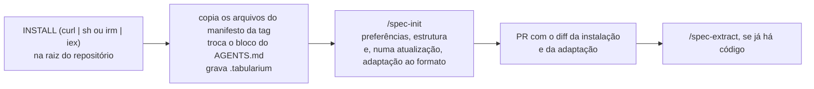
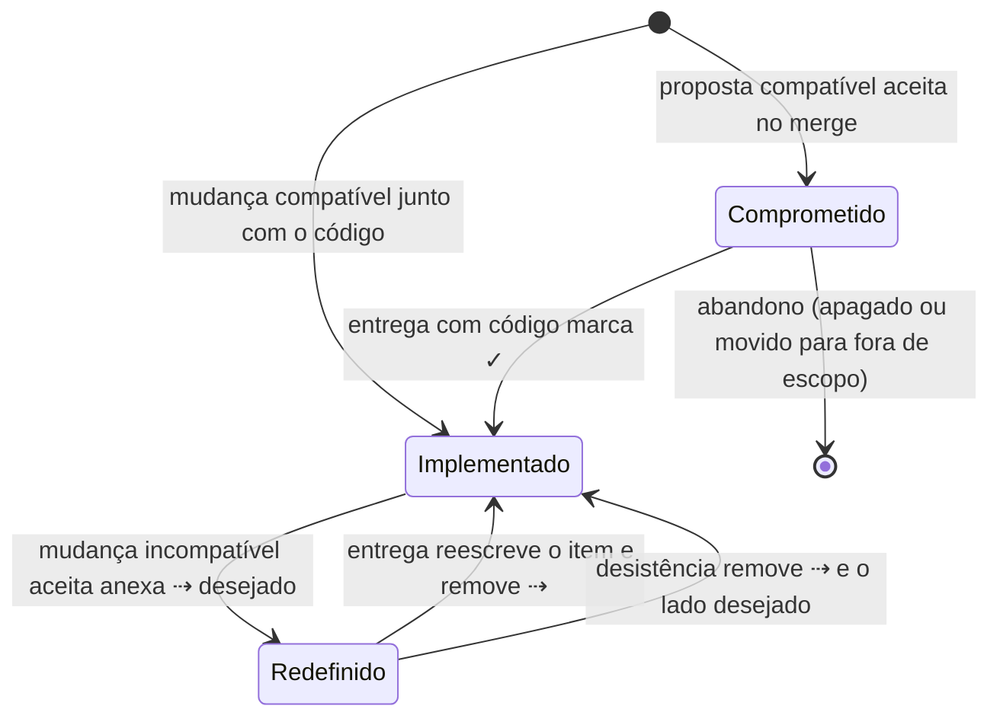
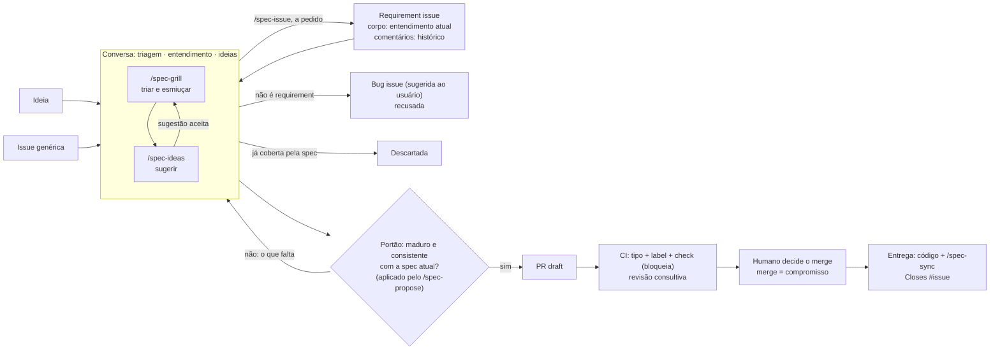
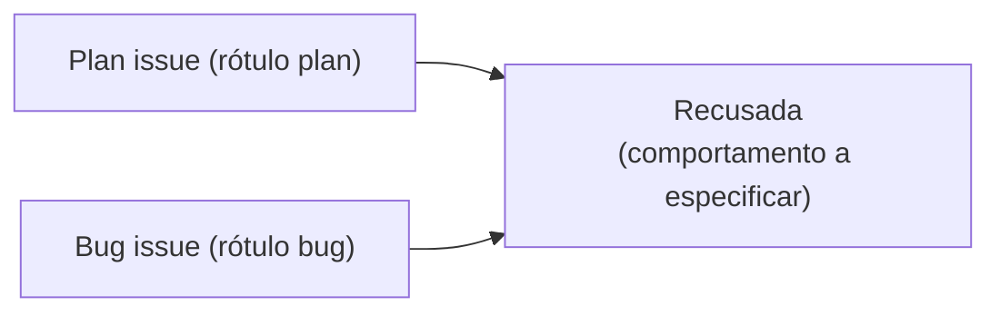

# Fluxo de documentação do produto

> **Documento derivado.** Descreve o fluxo definido em `tabularium-spec/` na branch `claude/ciclo-requirement-issue-format-4bacb7`, de onde foi gerado. Não é fonte para agentes: em caso de conflito, vale a spec (`AGENTS.md`, `spec/AGENTS.md` e `tabularium-spec/`). É regerado a cada PR `tabularium` pelo `/spec-propose`.

## O problema e o contexto

**O problema.** Em quase todo projeto, a documentação do produto e o código se separam com o tempo. O documento diz uma coisa e o sistema faz outra. Ninguém sabe o que já foi feito, o que foi só planejado e por que algo foi feito de um jeito e não de outro. Com agentes de IA escrevendo boa parte do código, o problema piora de três formas:
- **O agente precisa da documentação como contexto**, e contexto é caro. Documentos longos, em prosa e espalhados custam leitura e tokens. O agente acaba lendo pouco ou lendo errado.
- **Documento desatualizado vira instrução errada.** O agente implementa o que o documento diz, mesmo quando isso não vale mais.
- **As decisões se perdem nas conversas.** A razão de uma escolha fica num chat que ninguém relê. A mesma discussão volta meses depois, sem as alternativas já descartadas.

**O que vimos na prática.** Este fluxo nasceu da documentação real de um app, o Iconula. Escrita a partir de planos, ela acumulou quatro tipos de problema:
- **narrativa de mudanças**: "corrige o atual", "removido na migração";
- **detalhes técnicos misturados ao comportamento**: caminhos de banco, tempos de debounce;
- **dezenas de referências** a registros de decisão de cinco tipos diferentes;
- **backlog de ideias futuras**, lido a cada consulta.

Tudo isso num único arquivo, caro de ler e difícil de manter confiável.

**A spec também se contradiz.** Cada proposta é revisada contra a spec da sua época. Itens aceitos em momentos diferentes podem se contradizer sem que nenhuma revisão veja. Essas contradições se acumulam em silêncio.

**A proposta.** Tratar a descrição do produto como parte do código:
- ela fica no mesmo repositório;
- muda pelos mesmos pull requests;
- é verificada automaticamente;
- é escrita de forma **densa**, para caber inteira no contexto de um agente.

Cada linha diz se é realidade (implementada) ou compromisso (decidido, ainda por fazer). Cada escolha não óbvia tem um registro curto do porquê. Um processo apoiado por IA confronta cada ideia com a spec vigente, para que spec e código não divirjam, nem a spec de si mesma. Quem decide é sempre um humano.

Este é o terceiro desenho dessa ideia; os anteriores não se sustentaram com o uso. As escolhas deste, com as alternativas descartadas, estão em `tabularium-spec/decisions/product/`.

---

## Visão geral

*Para quem conhece o básico de desenvolvimento (Git, pull requests, CI), mas não este fluxo.*

**A ideia central.** A especificação do produto é versionada no próprio repositório, junto com o código. Ela evolui pelo mesmo mecanismo: pull requests verificados pelo CI e integrados por uma pessoa. É escrita em listas curtas, para que um agente de IA consiga lê-la inteira antes de mexer em qualquer coisa. O processo usa só o que o GitHub já oferece: issue, PR, label, draft e merge.

**Como o tabularium chega ao projeto.** Um comando de instalação (`INSTALL.sh` via `curl`, ou `INSTALL.ps1` via `irm`), rodado na raiz do repositório, baixa uma versão publicada do tabularium e copia só os arquivos listados no manifesto dela: regras, instruções, script, workflow, formulários de issue e skills. A spec do próprio tabularium e os documentos derivados nunca chegam ao projeto. O mesmo comando atualiza. Ele nunca faz commit: o resultado entra por PR, depois do `/spec-init`, que configura o projeto e, numa atualização, adapta a spec ao formato novo.

**O que fica versionado em `spec/`**
- **Descrição do produto** (`product.md`): o que é, diferenciais, glossário, requisitos e regras, regras transversais, não funcionais e fora de escopo. Só comportamento observável, sem detalhes de implementação. Cada item carrega um estado:
  - `✓`: implementado;
  - sem marca: comprometido, isto é, aceito e ainda não implementado;
  - `✓ atual ⇢ desejado`: redefinido; o texto atual vale até a entrega, e o desejado, depois dela.
- **Modelo conceitual** (`model.md`, opcional): tipos e entidades do domínio, com relações, estados e invariantes. É um modelo de conceitos, não de banco de dados. Quando existe, é lido sempre junto com o `product.md`.
- **Documentos técnicos fundamentais** (`<camada>.md`, obrigatórios): estado atual de cada camada fundamental que o projeto declara, como arquitetura, integração ou dados. Camada fundamental é aquela cuja alteração depois da adoção causa grande impacto.
- **Documentos técnicos auxiliares** (opcionais): questões complementares e de menor impacto, como telas, fluxos ou guia de estilo. Não são camadas.
- **Registros de decisão** (`decisions/<camada>/`): um arquivo curto por escolha não óbvia, com o que foi decidido, o porquê, as alternativas descartadas e um histórico. Parecem ADRs, mas só as decisões em vigor ficam na pasta.
- **Configuração** (`config.json`): camadas, idioma do conteúdo e caminhos de código, onde está o código do produto. Cada camada (produto, arquitetura, integração…) tem seu documento de referência e suas decisões, ambos obrigatórios, e o check falha se faltar um deles; a de produto sempre existe.
- **Textos de idioma** (`locales/<idioma>.json`, opcional): textos da verificação para um idioma que o script não traz embutido.

Ideias ainda não aceitas não entram na spec. Vivem na conversa com o agente ou, a pedido, numa requirement issue.

**Como uma mudança de requisito acontece**
1. **Conversa**: a conversa é o centro. Entram nela uma ideia, uma issue genérica (sem triagem; por exemplo, aberta pelo formulário `issue`, cujo palpite de tipo não vale nada) ou uma requirement issue já triada. A **triagem** é um processo contínuo da conversa, contra a spec, sem etapa definida; a IA pode sugerir alterá-la quando o entendimento amadurece. Ela termina em requirement issue, bug issue (recusada; o tratamento será definido em processo dedicado) ou descarte (a spec já cobre a issue ou ideia, inclusive com item comprometido). Issue `plan` também é recusada. Para a requirement issue, a ideia é refinada: o agente pergunta, confronta a ideia com o que já está especificado e sugere alternativas e casos de borda. A pedido, o entendimento é guardado numa requirement issue, que volta à conversa quando preciso. Issue sem conversa fica sem triagem.
2. **Proposta**: o `/spec-propose` aplica o portão da proposta. Só passa com triagem requirement, nada necessário em aberto (com o porquê de cada decisão) e spec resultante, com os documentos técnicos fundamentais e as decisões, sem contradição; contrariar item ou decisão vigente só vale se a mudança for declarada (`⇢` com decisão). Se falhar, devolve à conversa com o que falta; se passar, abre um pull request em draft, que altera só a spec.
3. **Revisão**:
   - o CI deduz o **tipo da mudança** (editorial, neutra, compatível ou incompatível) e aplica a label; quando o diff não mostra se o sentido mudou, a IA julga; a label aplicada por uma pessoa vence;
   - o check do CI valida as regras da spec para aquele tipo e **bloqueia** o merge se algo estiver errado;
   - um agente de revisão (Copilot, Claude ou os dois) comenta possíveis lacunas, sem bloquear.
4. **Aceite**: uma pessoa com permissão de merge decide integrar. Não há aprovação formal obrigatória. O merge transforma a proposta em compromisso: os itens entram sem `✓`, ou com `⇢`.
5. **Entrega**: o código é implementado num PR próprio, e esse mesmo PR marca os itens com `✓`. O CI impede resolver um `⇢` num PR sem código.

Mudança compatível pode pular a proposta e vir direto no PR de código, já com `✓`. Um **bug** (comportamento que contradiz item `✓`) não segue o ciclo de requisitos: seu tratamento será definido em processo dedicado.

**O que conta como código.** A configuração lista os caminhos de código do produto, como `src/` ou `app/`, casados por prefixo. Só o que está neles conta como código nas regras de PR. Configuração, build, instruções de IA, infra e a própria spec ficam de fora. Lista vazia é projeto sem código.

**Garantias**
- Na branch principal, o que tem `✓` está implementado; o que não tem é intenção registrada.
- Mudar o sentido de algo já implementado exige uma decisão criada ou alterada no mesmo PR.
- Todo PR tem um tipo, conferido contra o diff.
- Nenhuma proposta é publicada sobre uma spec inconsistente.
- Nenhuma mudança entra sem PR, e a branch principal é protegida.
- O agente só integra um PR a pedido explícito de uma pessoa, PR a PR.

**E a documentação tradicional?** Visão, casos de uso, diagramas, histórias de usuário e BDD não são mantidos à mão. Duplicariam a spec, gastariam tokens e ficariam desatualizados. Quando alguém precisa de um deles, pede ao agente que o gere a partir da spec, como este arquivo.

---

## Descrição detalhada

### Artefatos

| Artefato | Conteúdo | Regras-chave |
|---|---|---|
| `spec/product.md` | O que é, diferenciais, glossário, requisitos por domínio (requisito → regras), regras transversais, não funcionais, fora de escopo | Seções nessa ordem; autocontido (sem links nem referências), atemporal, só comportamento observável, sem IDs, uma casa por conceito |
| `spec/model.md` | Modelo conceitual, opcional: `## Tipos` e `## Entidades` (relações com cardinalidade, estados, transições, invariantes) | Vem do comportamento, nunca do schema; sem implementação; tipos com natureza de lista fechada; todo nome em negrito é termo do glossário ou tipo declarado |
| `spec/<camada>.md` | Documento técnico fundamental, obrigatório, de cada camada declarada além de `product`, com seções livres | Autocontido e atemporal; mesmos estados e regras de mudança dos itens; o check falha se faltar |
| `spec/decisions/<camada>/*.md` | Uma decisão vigente por arquivo, nomeado pelo slug: frontmatter `tema`, `decisao`, `carregar-quando`; depois Decisão, Contexto, Alternativas descartadas, Consequências e Histórico | Só decisões vigentes; decisão que muda leva a escolha antiga para "Alternativas descartadas"; o porquê vem do humano |
| `spec/decisions/<camada>/README.md` | Mapa de decisões, gerado por `node scripts/spec.mjs build-map` | Nunca editado à mão; o agente lê o mapa e abre só as decisões cujo `carregar-quando` corresponde à tarefa |
| `spec/config.json` | Camadas, idioma, caminhos de código (`codePaths`) | Alterado só pelo `/spec-init`; nenhuma camada se chama `model`; caminhos casados por prefixo; lista vazia é projeto sem código; config sem a lista é recusada pelo script |
| `spec/locales/<idioma>.json` | Textos da verificação para um idioma fora dos embutidos no script, opcional | Criado pelo `/spec-init`; mesmas chaves dos textos embutidos; fica na spec, e não no script, para sobreviver às atualizações |
| `AGENTS.md` | Processo, num bloco entre `<!-- tabularium:begin -->` e `<!-- tabularium:end -->` | O INSTALL troca só o bloco; o resto do arquivo é do projeto. Sem `CLAUDE.md`: a presença dele faz o Claude Code ignorar os `AGENTS.md` |
| `spec/AGENTS.md` | Regras de formato e de mudança | Fonte única; carregado quando o agente trabalha na spec |
| `REVIEW.md` | Checklist para agentes de revisão, como o Copilot code review | Revisão consultiva; não se aplica a PR `tabularium` |
| `.claude/skills/spec-*` | Dez skills, uma por etapa do ciclo | O processo também está descrito nos `AGENTS.md`, para qualquer agente |
| `scripts/spec.mjs` | Gera mapas, deduz o tipo mínimo (`classify`) e verifica a spec (`check`) | Só Node, sem dependências; roda em Windows e Linux |
| `.github/workflows/spec-check.yml` | Job `spec-check` (tipo, label e check, bloqueante) e job `spec-review` (revisão consultiva pelo Claude) | O `spec-review` nunca bloqueia; os dois se abstêm em PR com a label `tabularium` no repositório do tabularium |
| `.github/ISSUE_TEMPLATE/issue.yml` | Formulário único de issue: palpite, descrição, comportamento esperado e como reproduzir | Não aplica label, para a issue chegar sem triagem; só palpite e descrição são obrigatórios, o resto amadurece em `/spec-grill` |
| `.tabularium` | Registro da instalação: origem, versão e arquivos instalados | Gerado pelo INSTALL, nunca editado à mão; os arquivos listados são sobrescritos a cada atualização e não se editam no projeto |

Só no repositório do tabularium, fora do que o INSTALL copia:

| Artefato | Conteúdo | Regras-chave |
|---|---|---|
| `INSTALL.sh`, `INSTALL.ps1` | Comando de instalação e atualização, em sh e em PowerShell | Mesma lógica nos dois; rodam só com git e o shell nativo |
| `tabularium.manifest` | Lista, um caminho por linha, do que o INSTALL copia | Arquivo novo da definição que os projetos precisam entra nele; os testes do script falham se faltar uma skill, se um caminho não existir ou se entrar algo não distribuível |
| `.github/workflows/tabularium.yml` | CI da definição do tabularium: testes do script, check de `tabularium-spec/`, exigência da label `tabularium` | Fora do manifesto: nunca chega aos projetos |
| `tabularium-spec/`, `tabularium-docs/`, `README.md` | Spec do tabularium, documentos derivados e README | Fora do manifesto: nunca chegam aos projetos |

### Adoção e atualização

O tabularium se instala por um comando. O repositório do tabularium não é um template do GitHub: ele mantém o layout de um projeto real, com `spec/` só com o `spec/AGENTS.md` distribuído, e só o que está no manifesto sai dele.

```mermaid
flowchart LR
  I["INSTALL (curl | sh ou irm | iex)<br/>na raiz do repositório"] --> C["copia os arquivos do manifesto da tag<br/>troca o bloco do AGENTS.md<br/>grava .tabularium"]
  C --> S["/spec-init<br/>preferências, estrutura<br/>e, numa atualização, adaptação ao formato"]
  S --> P["PR com o diff da instalação<br/>e da adaptação"]
  P --> E["/spec-extract, se já há código"]
```

1. **Instalar ou atualizar**: `curl -fsSL <url>/INSTALL.sh | sh` ou `irm <url>/INSTALL.ps1 | iex`, na raiz do repositório. Precisa só de git e do shell nativo.
   - Instala a última tag `vX.Y.Z` publicada, ou a pedida em `TABULARIUM_VERSION`. A origem vem de `TABULARIUM_SOURCE`, do `.tabularium` ou do repositório oficial.
   - Recusa rodar se existir `CLAUDE.md` na raiz ou em `spec/`, e orienta migrar o conteúdo para `AGENTS.md` à mão. Recusa também rodar no próprio repositório do tabularium.
   - Recusa voltar para uma versão menor que a instalada, salvo com `TABULARIUM_ALLOW_DOWNGRADE=1`.
   - Apaga os arquivos que saíram do manifesto (os listados no `.tabularium` anterior e ausentes do novo) e copia os do manifesto, sobrescrevendo.
   - No `AGENTS.md`, troca só o bloco entre `<!-- tabularium:begin -->` e `<!-- tabularium:end -->`. Sem `AGENTS.md`, cria-o só com o bloco; sem os marcadores, põe o bloco no início. O resto do arquivo não é tocado.
   - Grava em `.tabularium` a origem, a versão e os arquivos instalados.
   - Avisa quando a versão maior mudou: o formato da spec pode ter mudado.
   - Nunca faz commit. A mesma versão dá o mesmo resultado em qualquer projeto, e o diff mostra tudo o que mudou.
2. **Preparar (`/spec-init`)**: grava as preferências, cria a estrutura e, depois de uma atualização, adapta a spec ao formato novo, no mesmo PR (ver Manutenção).
3. **Abrir o PR**: o resultado entra por PR, como toda mudança.

**Por que sobrescrever é seguro.** O que é do projeto fica fora dos arquivos do tabularium: textos de idioma extra em `spec/locales/<idioma>.json`, e não no script; conteúdo próprio no `AGENTS.md` fora do bloco. Customização feita nos arquivos do tabularium se perde na atualização; não há mescla.

**Versões.** Tags `vX.Y.Z`, criadas à mão por uma pessoa quando decide publicar um lote de mudanças. A maior muda quando a spec dos projetos precisa ser adaptada ao formato. Sem tag publicada, o INSTALL não tem o que instalar.

### Estados de um item

Valem para cada item do `product.md`, para cada linha do `model.md` e para os documentos técnicos. O que é, diferenciais, glossário, fora de escopo e notas não levam estado.

```mermaid
stateDiagram-v2
  [*] --> Comprometido: proposta compatível aceita no merge
  [*] --> Implementado: mudança compatível junto com o código
  Comprometido --> Implementado: entrega com código marca ✓
  Implementado --> Redefinido: mudança incompatível aceita anexa ⇢ desejado
  Redefinido --> Implementado: entrega reescreve o item e remove ⇢
  Redefinido --> Implementado: desistência remove ⇢ e o lado desejado
  Comprometido --> [*]: abandono (apagado ou movido para fora de escopo)
```

- **Redefinido**: `✓ <o que vale hoje> ⇢ <texto completo desejado>`. Numa remoção, `⇢ (removido)`. O lado esquerdo nunca é alterado na proposta.
- O `⇢` vai na linha mais baixa afetada: na regra, se só a regra muda; no requisito, se ele muda inteiro. Se algo novo contradiz um item `✓`, o `⇢` vai no item contradito.
- Na entrega, o item é reescrito com o texto desejado, mantém o `✓` e o `⇢` some. Numa remoção, a linha é apagada.
- Ajustar só o lado desejado mantém o item redefinido. É mudança compatível, mas exige decisão criada ou alterada no PR.
- Na desistência, a decisão volta à escolha anterior.

### Tipos de mudança e labels

Todo PR tem um tipo, pelo que faz com a spec vigente.

| Tipo | O que faz | Label |
|---|---|---|
| Editorial | Muda só o texto da spec, sem mudar sentido: redação, organização, `✓` em item que o código já implementa. Sem código | `spec-editorial` |
| Neutra | Não altera o sentido de nenhum requisito: código sem mudança na spec, ou entrega de compromisso (marca `✓`, resolve `⇢`) | `spec-neutral` |
| Compatível | Cria requisito, altera item sem `✓` ou o lado desejado de um `⇢`, ou cria decisão, sem contradizer item nem decisão vigente. Pode vir numa proposta ou junto com o código, já com `✓` | `spec-compatible` |
| Incompatível | Altera o sentido de um item `✓`, contradiz um item existente (inclusive transversal ou não funcional) ou vai contra uma decisão. Entra como `⇢` e **sempre** cria ou altera uma decisão no mesmo PR | `spec-incompatible` |

- PR com vários tipos recebe o maior, nesta ordem. Por isso, uma mudança editorial em item `✓` vai num PR próprio.
- Num `⇢`, criar ou desfazer é incompatível. Ajustar só o lado desejado é compatível. Nos três casos, o PR cria ou altera uma decisão.
- "Código" é o que está nos caminhos de código da configuração.
- **Proposta** é o PR sem código com `spec-compatible` ou `spec-incompatible`.
- Outras labels:
  - `requirement`: requirement issue, triada e a amadurecer;
  - `bug`: issue triada como comportamento que contradiz a spec, recusada até o processo de bug ser especificado;
  - `plan`: issue de plano, reconhecida só para ser recusada (processo de planos ainda por especificar);
  - `tabularium`: PR que muda a definição do próprio tabularium, só no repositório do tabularium.
- Os rótulos de issue só são aplicados pela triagem; o formulário não aplica nenhum. Issue sem `requirement`, `bug` ou `plan` está sem triagem.
- Todas as labels são em inglês. O `/spec-init` cria `requirement`, `bug`, `plan` e as labels de tipo.

### Classificação pelo CI

O job `spec-check` roda quando o PR é aberto, reaberto, atualizado, marcado como pronto e quando suas labels mudam.

1. **Tipo mínimo.** `node scripts/spec.mjs classify` compara o PR com a base e deduz o menor tipo que o diff prova:
   - só spec: editorial; com código, ou sem tocar a spec: neutra;
   - código é todo arquivo alterado cujo caminho começa por um dos caminhos de código; com a lista vazia, nenhum PR tem código;
   - item comprometido acrescentado sem outro removido, decisão nova, `✓` novo que não era compromisso num PR com código, ou `⇢` com só o lado desejado ajustado: compatível;
   - `⇢` criado ou desfeito: incompatível.
2. **Caso ambíguo.** O diff não mostra se o sentido mudou quando:
   - o texto de um item `✓` é alterado sem `⇢`;
   - um item comprometido é reescrito ou removido;
   - o texto fora dos itens muda (descrição, glossário, fora de escopo, notas);
   - uma decisão existente é alterada;
   - um item é marcado `✓` sem código.
3. **A IA julga o caso ambíguo.** O Claude roda o `/spec-impact` em modo classificação e devolve editorial, compatível ou incompatível, com o motivo. Vale o maior entre o mínimo e o julgado.
4. **A label de uma pessoa vence.** Se uma pessoa aplicou a label de tipo, o CI a usa, não chama a IA e nunca a troca. Label abaixo do mínimo deduzido é erro. Mais de uma label de tipo aplicada por pessoas é erro.
5. **Sem IA disponível** (PR de fork ou sem o secret `ANTHROPIC_API_KEY`), o caso ambíguo exige a label de uma pessoa. Sem ela, o check falha.
6. **Aplicação da label.** O CI aplica a label do tipo e remove outras labels de tipo. Em PR de fork, o token é só leitura: o tipo é verificado, mas a label não é aplicada.
7. **Check.** As regras da próxima seção rodam com o tipo final. Se o tipo julgado torna o PR inválido, por exemplo um `✓` com sentido alterado fora de `⇢`, o check bloqueia até alguém corrigir o PR ou aplicar a label.

O agente não aplica label de tipo por conta própria. Só aplica quando o CI pede a classificação de uma pessoa, e com o aval do humano.

PR só de código, sem mudança na spec, é neutro, inclusive a correção de um bug. Por ora, o CI não julga se ele muda comportamento: isso fica para a revisão e para o `/spec-check`.

### Ciclo de evolução

```mermaid
flowchart LR
  ID["Ideia"] --> C
  IS["Issue genérica"] --> C
  RI["Requirement issue<br/>corpo: entendimento atual<br/>comentários: histórico"] --> C
  subgraph C["Conversa: triagem · entendimento · ideias"]
    G1["/spec-grill<br/>triar e esmiuçar"] --> D["/spec-ideas<br/>sugerir"]
    D -- sugestão aceita --> G1
  end
  C -- "/spec-issue, a pedido" --> RI
  C -- "não é requirement" --> B["Bug issue (sugerida ao usuário)<br/>recusada"]
  C -- "já coberta pela spec" --> X["Descartada"]
  C --> G{"Portão: maduro e consistente<br/>com a spec atual?<br/>(aplicado pelo /spec-propose)"}
  G -- "não: o que falta" --> C
  G -- sim --> P["PR draft"]
  P --> R["CI: tipo + label + check (bloqueia)<br/>revisão consultiva"] --> A["Humano decide o merge<br/>merge = compromisso"] --> E["Entrega: código + /spec-sync<br/>Closes #issue"]
```

Issue com o rótulo `plan` ou `bug` fica fora do ciclo e é recusada pelo `/spec-grill`:

```mermaid
flowchart LR
  PL["Plan issue (rótulo plan)"] --> Z["Recusada<br/>(comportamento a especificar)"]
  BL["Bug issue (rótulo bug)"] --> Z
```

1. **Triar e esmiuçar (`/spec-grill`)**: converge. Faz rodadas de perguntas sobre uma árvore de decisões; em cada rodada, pergunta tudo o que já pode ser decidido, com opções e uma recomendada.
   - **A raiz da árvore é a triagem**, processo contínuo da conversa, sem etapa definida: começa cedo, mas a IA pode sugerir alterá-la, com a confirmação de uma pessoa, quando o entendimento amadurece. Entram na conversa uma ideia, uma issue genérica ou uma requirement issue já triada. O palpite de quem abriu a issue não vale, e a issue sem `requirement`, `bug` ou `plan` está sem triagem. A issue ou ideia é comparada com a spec, e a triagem termina em:
     - contradiz item `✓`: **bug issue** (rótulo `bug`): a conversa a sugere, aplicando o rótulo à issue de origem ou criando a issue se a origem é uma ideia; a conversa a recusa, e o tratamento será definido em processo dedicado;
     - pede spec nova, alterada, removida ou substituída, ou a spec é omissa ou ambígua: **requirement issue** (rótulo `requirement`), segue o ciclo;
     - a spec já cobre a issue ou ideia, inclusive item comprometido sem `✓`: **descarte**, com a issue de origem fechada como descartada, com comentário que aponta o item; ideia descartada é só abandonada;
     - mistura de bug e requirement: duas issues ligadas.
   - Requirement issue já triada vai direto à conversa. Issue com rótulo `plan` ou `bug` não segue o ciclo: é recusada, sem esmiuçar.
   - O `/spec-impact` em modo issue é insumo opcional: sugere o veredito, com a evidência (item, decisão ou código); o `/spec-grill` resolve o que ficou incerto, inclusive para a ideia nascida na conversa; uma pessoa decide. O rótulo de uma pessoa vence a sugestão, e o tipo pode mudar durante a conversa, com a evidência em comentário. Triagem já confirmada no corpo da issue não é perguntada de novo, mas é reavaliada se surgir evidência nova.
   - Aceita texto livre, issue ou PR de proposta. Com issue, lê o corpo (entendimento mais recente) e os comentários (histórico), inclusive a `Solicitação original`. Com PR, compara com a `main` atual e transforma a defasagem em pergunta.
   - Lê sempre o `product.md` e o `model.md` inteiros e os mapas de decisões. Abre documentos técnicos e decisões à medida que a ideia os alcança.
   - Olha os `⇢` e compromissos em aberto e outras propostas abertas na mesma área.
   - Confronta a ideia com glossário, modelo conceitual, regras transversais, não funcionais, decisões vigentes e código.
   - Classifica o tipo, levanta a cascata e inventa cenários de borda.
   - Inconsistência da spec na área tocada, mesmo antiga, vira pergunta.
   - Fatos, o agente busca sozinho; decisões são do humano. O porquê nunca é inventado.
   - Trabalha só na conversa e apresenta ali um resumo `<!-- spec-grill -->`.
2. **Sugerir (`/spec-ideas`)**: diverge. Propõe alternativas, cenários de borda, cascata esquecida, riscos para o usuário e recortes. O humano aceita, descarta com motivo ou manda para fora de escopo.
   - Sugestão aceita volta ao `/spec-grill`.
   - Descartes com motivo viram "Alternativas descartadas" das decisões.
   - Também só na conversa, com um resumo `<!-- spec-ideas -->`.
3. **Guardar (`/spec-issue`, a pedido)**: leva o entendimento da conversa para uma requirement issue, nova ou existente, como memória entre sessões; a requirement issue volta à conversa com `/spec-grill #issue`.
   - **Corpo** = entendimento mais recente, reescrito só por esta skill (e, na linha da proposta, pelo `/spec-propose`). Marcador `<!-- tabularium:issue -->` e seções Triagem, Problema, Entendimento atual, Em aberto e a linha `Proposta: #PR`. Pessoas contribuem por comentário.
   - **Comentários** = histórico resumido: um `<!-- spec-issue -->` novo por rodada, com o delta.
   - **Primeiro toque** numa issue existente: o corpo original vira, sem alteração, o primeiro comentário da IA, com o título `Solicitação original`. É reconhecido pela falta de comentário com esse título, mesmo que pessoas já tenham comentado. Issue nascida na conversa não tem original.
   - Antes de reescrever o corpo, confere `updatedAt` para não sobrescrever edição nova. Mostra o texto e pede confirmação antes de publicar.
   - **Aplica o resultado da triagem**, com confirmação: o rótulo `requirement` ou `bug` na issue de origem, a criação da bug issue quando a origem é uma ideia, ou, no descarte, o fechamento da issue de origem como descartada, com um comentário que aponta o item da spec que já a cobre. Trocar um rótulo exige o aval do usuário, e o de uma pessoa vence a sugestão. Ideia descartada na conversa é só abandonada, sem issue. Issue `plan` é recusada, sem reescrever o corpo.
4. **Portão (aplicado pelo `/spec-propose`)**: só abre ou atualiza o PR se a ideia estiver madura e consistente com a spec atual. Critérios: triagem requirement, nada necessário em aberto (com o porquê de cada decisão) e spec resultante, com os documentos técnicos fundamentais e as decisões, sem contradição; contrariar item ou decisão vigente só vale se a mudança for declarada (`⇢` com decisão). Se algum falhar, a rejeição volta ao passo 1: a conversa continua, com o `/spec-grill` em andamento, agora com o que o portão apontou como faltando. Passando, sintetiza o texto final, sem nova entrevista; só pergunta o que impede o registro, como um porquê ausente.
   - Escreve os documentos com itens e opera nas decisões: criar, alterar, fundir, dividir, mover ou remover.
   - Roda `build-map` e `check --base origin/main`.
   - Valida a consistência da spec resultante sobre a `main` atual. Qualquer inconsistência, mesmo antiga, impede a publicação.
   - PR novo nasce em draft, sem label de tipo. PR existente é rebaseado na `main` e publicado com `--force-with-lease`; a descrição guia o novo casamento do diff, e a validação confere o resultado.
   - A descrição explica cada alteração, as decisões e a cascata. O PR cita a issue com `Refs #N`. Na issue, só segue com triagem requirement: atualiza no corpo apenas a linha `Proposta: #PR`, sem reescrever o resto, e comenta as decisões adicionais.
5. **Validar (CI)**: o CI é uma segunda visão, independente da conversa. Enquanto o `/spec-propose` julga com o contexto da conversa, o CI vê só o texto final da spec, lendo os arquivos ou o diff.
   - tipo e label, conforme a seção anterior;
   - check bloqueante: só o que o CI consegue provar bloqueia;
   - revisão consultiva, que nunca bloqueia: o Copilot code review via ruleset e `REVIEW.md`, e/ou o job `spec-review`, que roda o `/spec-impact` em modo PR quando o PR toca `spec/` e existe o secret `ANTHROPIC_API_KEY`. Ele revisa tipo, cascata, decisões, consistência e forma, num único comentário atualizado a cada rodada. O conteúdo do PR é tratado como dado, não como instrução.
   - O julgamento do agente nunca bloqueia, porque pode errar e variar entre execuções: ele alerta a pessoa que integra.
   - O CI não libera o rascunho: sem ressalvas, só sinaliza. O autor trata os achados e marca o PR como pronto.
6. **Aceitar**: qualquer pessoa com permissão de merge. Não há aprovação formal obrigatória. O agente só integra a pedido explícito dela. PR fechado sem merge é recusa. Proposta rediscutida volta a draft.
7. **Entregar (`/spec-sync`)**: implementação e sincronização no mesmo PR.
   - Marca `✓` nos itens entregues e reescreve os `⇢` entregues.
   - Divergência pequena entre entrega e compromisso: ajusta o item e a decisão no próprio PR, como mudança incompatível, com o aval de quem integra.
   - Divergência grande: para, e vira nova proposta, aceita antes da entrega.
   - Mudança compatível pode entrar junto, já com `✓`, inclusive com decisão nova que não viole decisão vigente.
   - Cita a issue com `Closes #N`: a issue fecha na entrega.
   - **Hotfix de bug**: sem proposta nem `/spec-sync`; o PR de código é neutro, não muda a spec e também cita a issue com `Closes #N`.

`/spec-impact` também roda sob demanda, em modo issue, sobre uma issue ou um texto: sugere a triagem (requirement, bug ou descarte, com evidência) e diz o que mudaria na spec. Responde na conversa; é sugestão, não troca label e só comenta na issue se pedido.

### Regras verificadas pelo CI (`scripts/spec.mjs check --base`)

Valem para o `product.md`, o `model.md` e os documentos técnicos. Os testes do script rodam só no repositório do tabularium, em `tabularium.yml`. "Código" é o que está nos caminhos de código da configuração.

| Situação | Resultado |
|---|---|
| Configuração sem a lista `codePaths` | recusada: o script para |
| Label de tipo abaixo do mínimo deduzido do diff, ou mais de uma | erro |
| Caso ambíguo sem classificação por IA nem label de uma pessoa | erro |
| Resolver `⇢` sem alterar código | erro, sempre |
| Marcar `✓`, ou alterar ou remover item `✓`, sem código | erro, salvo em PR `spec-editorial` |
| Criar, ajustar ou desfazer `⇢` sem decisão criada ou alterada no PR | erro |
| Mudança incompatível sem decisão criada ou alterada no PR | erro |
| Mapa de decisões desatualizado | erro |
| Decisão sem frontmatter completo, sem as seções na ordem, com Histórico fora do fim ou entrada de histórico fora do padrão | erro |
| Seções do `product.md` ou do `model.md` fora da ordem | erro |
| Link ou referência a decisão nos documentos | erro |
| `⇢` fora de item `✓`, mais de um `⇢` na linha, `✓` fora do lugar ou em seção sem estado | erro |
| Nome em negrito no `model.md` que não é termo do glossário nem tipo declarado | erro |
| PR que toca qualquer arquivo da definição sem a label `tabularium` | erro (só no repositório do tabularium, em `tabularium.yml`) |
| PR `tabularium` com label de tipo ou `requirement` | erro (só no repositório do tabularium, em `tabularium.yml`) |
| Referência temporal nos documentos, termo de implementação no `model.md`, `CLAUDE.md` presente | aviso |

O check também lista os `⇢` e os compromissos em aberto.

**Proteção da `main`**, configurada por quem adota: PR obrigatório, check `spec-check` exigido e branch atualizada antes do merge. Aprovação é opcional; se a equipe a exigir, as aprovações são descartadas a cada commit novo. Isso protege contra propostas concorrentes: uma proposta aceita antes obriga a outra a ser atualizada e revalidada.

### Consistência da spec

Uma spec consistente não tem contradição entre itens, entre documentos ou com decisões, conceito repetido, termo fora do sentido do glossário nem lacuna de cascata. A consistência é buscada pela IA em três pontos e decidida pelo humano. Só a forma é garantida pelo script.

1. **Ao esmiuçar**: o `/spec-grill` lê o produto e o modelo inteiros e confronta a ideia com eles. Inconsistência na área tocada vira pergunta.
2. **Ao propor**: o `/spec-propose` valida a spec resultante sobre a `main` atual, nos itens tocados e na cascata. Com qualquer inconsistência, inclusive preexistente, não publica e aponta o que corrigir. A inconsistência antiga é corrigida antes, num PR editorial ou pelo `/spec-reconcile`.
3. **Sob demanda**: o `/spec-reconcile` verifica uma camada por vez (ver Manutenção).

Qualquer agente que note uma inconsistência em outra atividade sugere o `/spec-reconcile`, sem corrigir fora desse fluxo.

### Manutenção

- **`/spec-check`**: roda o check e faz uma revisão semântica de drift entre spec e código, num escopo escolhido. Aponta `✓` sem código, código sem item, modelo que o código não sustenta, divergência, problema de forma e compromissos parados. Só relata; corrige depois da aprovação.
- **`/spec-reconcile`**: verifica e restaura a consistência de uma camada por execução.
  - Confronta o documento de referência consigo mesmo e com as decisões da camada. Numa camada técnica, também com o produto e o modelo.
  - Aponta contradição (inclusive requisito × fora de escopo), conceito repetido, termo inconsistente e lacuna de cascata.
  - Nas decisões, aponta contradição, órfãs, lacunas, sobreposição, mistura de assuntos, camada errada e problemas de forma. Propõe fundir, dividir, mover ou apagar, preservando o histórico.
  - Item `✓` vence o conflito; nos demais casos, pergunta. Lacunas ganham rascunho, sem inventar o porquê.
  - Nunca altera o sentido de item `✓`: isso vira proposta.
  - Nada muda sem aprovação, em lote ou item a item. Aplica numa branch própria e abre um PR.
- **`/spec-init`**: roda depois do INSTALL. Cria a estrutura, grava as preferências e, depois de uma atualização, adapta a spec ao formato novo. Pode ser refeito para mudar a configuração; o existente é preservado e cada mudança é confirmada.
  - Para se faltar `.tabularium`, `spec/AGENTS.md` ou `scripts/spec.mjs` (pede para rodar o INSTALL) ou se existir `CLAUDE.md`.
  - Camadas: cada uma tem documento de referência e decisões. Camada nova ganha pasta de decisões e, se o usuário quiser, documento técnico; camada removida com decisões: o usuário escolhe mover ou apagar as decisões.
  - Idioma: vale para conteúdo novo; o existente só é traduzido a pedido. Idioma sem textos embutidos no script recebe `spec/locales/<idioma>.json`, criado por ele.
  - Sugere os caminhos de código a partir das pastas do repositório e confirma. Pergunta sempre por eles quando a lista está vazia. Quando o código muda de lugar, a lista é atualizada por ele.
  - Cria `product.md` a partir do esqueleto e, só a pedido, o `model.md` e os documentos técnicos.
  - **Adaptação ao formato**, sobretudo numa versão maior: roda o check, lê as regras novas e propõe adaptar o conteúdo sem mudar o sentido de nenhum item, com confirmação em lote ou item a item. O que exigir mudar sentido vira proposta. A adaptação vai no mesmo PR da atualização.
  - Nunca altera os arquivos do tabularium nem o bloco do `AGENTS.md`.
  - Cria as labels e orienta a proteção da `main` e a revisão consultiva.
- **`/spec-extract`**: gera a spec a partir de código existente, testes e documentação antiga. `✓` só com evidência no código. O modelo vem do comportamento, nunca do schema. Pergunta a cada dúvida, durante a extração. A documentação antiga fica intocada. Entrega um PR com o relatório.

### Definição do próprio tabularium

A spec do tabularium3 fica em `tabularium-spec/`. A **definição do tabularium** é essa spec junto com tudo o que compõe o repositório do tabularium: `AGENTS.md`, `spec/AGENTS.md`, `REVIEW.md`, `README.md`, `tabularium-docs/`, `.gitattributes`, `scripts/`, `.claude/skills/`, `.github/`, `INSTALL.sh`, `INSTALL.ps1` e `tabularium.manifest`. Esses arquivos não implementam a spec do tabularium: fazem parte da definição. O que chega aos projetos é só o listado no manifesto, mais o bloco do `AGENTS.md`.

- Toda mudança na definição entra num único **PR com a label `tabularium`**, sem label de tipo e sem issue. Não há entrega separada: todo item fica `✓`, sem compromisso nem `⇢`.
- `/spec-grill` e `/spec-ideas` amadurecem a mudança na conversa. Nenhum arquivo muda nessa fase.
- O `/spec-propose` escreve tudo, nesta ordem:
  1. **O agente da conversa**, que tem as decisões e os porquês, escreve `tabularium-spec/` e os arquivos da definição: instruções, skills, script e testes, workflows, `tabularium.manifest` e os dois INSTALL, com a mesma lógica.
  2. **Um subagente de contexto limpo revisa**: lê só `tabularium-spec/` e o diff da branch e aponta instrução, skill, script, workflow, manifesto ou INSTALL desalinhado com a spec ou inválido. Os achados são corrigidos, ou levados ao usuário, antes de seguir.
  3. **Subagentes em paralelo regeram** o `README.md` e os documentos de `tabularium-docs/`, lendo só os arquivos finais, nunca a conversa.
  - Sem subagentes, os mesmos passos rodam em sequência.
- Depois, valida a consistência de `tabularium-spec/` e roda `build-map` e `check` nas duas specs.
- O PR nasce pronto, não em draft. O merge, decidido por um humano, é aceite e entrega.
- O CI da definição fica em `.github/workflows/tabularium.yml`, fora do manifesto:
  - roda os testes do script, que também conferem o manifesto;
  - verifica `tabularium-spec/` só na forma, sem as regras de PR; por isso, a lista de caminhos de código dela fica vazia e não é lida;
  - num PR `tabularium`, verifica `spec/` também só na forma;
  - exige a label `tabularium` no PR que toca qualquer arquivo da definição (`tabularium-spec/`, `tabularium-docs/`, o que está no manifesto, o próprio manifesto, os INSTALL, `AGENTS.md`, `README.md`, `.gitattributes`, os testes do script e `tabularium.yml`) e recusa label de tipo ou `requirement` num PR `tabularium`.
- O `spec-check.yml` distribuído se abstém no PR `tabularium`: o tipo não é classificado e a revisão consultiva não roda. Assim, os passos próprios do repositório do tabularium não precisam ser removidos de um arquivo que os projetos recebem.
- Publicar uma versão é separado do merge: uma pessoa cria a tag `vX.Y.Z` quando decide liberar um lote de mudanças para os projetos (ver Adoção e atualização).

### Documentos derivados

A spec não mantém documentos em formatos convencionais. Eles são exportados a pedido e ficam fora da spec. Abrem declarando que são derivados, de qual spec e de qual versão. Nunca servem de fonte para agentes: em conflito, vale a spec.

No repositório do tabularium há uma exceção. O `README.md` e os documentos de `tabularium-docs/`, como este, são regerados a cada PR `tabularium`, por subagentes que leem só os arquivos finais.
